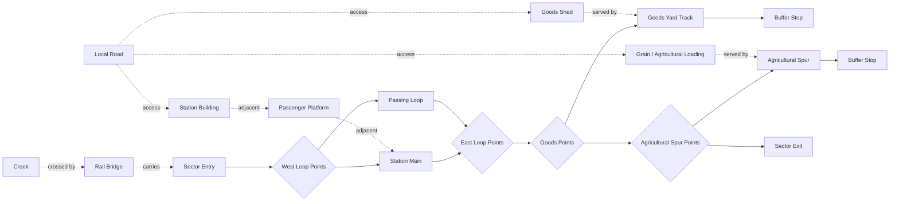
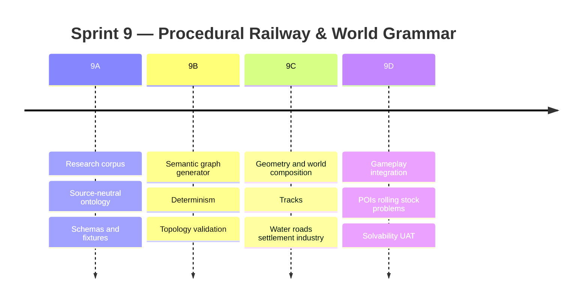

# Procedural Railway & World Grammar Research Artifact

## Executive summary

### Purpose

This document is intended to serve two roles simultaneously:

1. a **design and research reference** that can live in `train_scav/docs/worldgen/`; and
2. an **implementation specification** that can be handed directly to Codex for the next procedural-generation sprint.

The central recommendation is:

> **Generate railway meaning first, physical geometry second, surrounding world relationships third, and gameplay state last.**

In other words, do **not** begin with random splines, turnouts, buildings and waterways and then attempt to infer whether the result resembles a plausible railway. Generate an explicit semantic railway graph describing *why each track exists*, validate that graph, embed it into geometry, then place roads, water, settlement, industry, POIs, rolling stock and gameplay problems according to relationships with that graph.

That recommendation has strong precedent outside games. The European Union Agency for Railways models railway infrastructure as distinct semantic entities including tracks, switches, platforms, bridges and level crossings, and its current vocabulary explicitly treats linear railway elements as edges in a topological graph. Railway-engineering research likewise represents station layouts as graphs in which endpoints and switches are vertices and tracks connect those vertices; graph methods can then derive and validate routes. citeturn13search2turn15search0turn15search1

For `train_scav`, the architecture should therefore become approximately:

```text
RUN SEED
   ↓
REGION PROFILE
   ↓
ARCHETYPE SELECTION
   ↓
SEMANTIC RAIL GRAPH
   ↓
WORLD RELATIONSHIP GRAPH
   ↓
CONSTRAINT VALIDATION
   ↓
2D PHYSICAL EMBEDDING
   ↓
TERRAIN / WATER / ROADS / SETTLEMENT
   ↓
POIs / ROLLING STOCK / PROBLEMS
   ↓
SOLVABILITY VALIDATION
   ↓
SECTOR BLUEPRINT
   ↓
existing RailMovement
existing YardOperations
existing SectorPOIs
existing Crew / Resources / Lifecycle
```

This is a particularly natural evolution of the existing code. `SectorDefinition` already contains deterministic seed and route metadata but remains comparatively thin; `SectorInstance` already owns disposable rail, yard and POI state; `RailMovement` currently contains a hand-authored collection of named track segments and geometry; and `SectorPOIs` currently contains deterministic but fixed POIs and resource yields. fileciteturn3file0 fileciteturn4file0 fileciteturn5file0 fileciteturn7file0

The roadmap also places “deeper procedural sector variety” first in post-validation Phase C, after the vertical slice, which makes this the appropriate moment to improve world generation rather than introduce unrelated systems. fileciteturn6file0

### Sprint hypothesis

The proposed Sprint 9 hypothesis is:

> **A research-derived semantic railway/world grammar can generate deterministic sectors that feel geographically plausible, operationally meaningful and materially different, while preserving the physical railway, crew, scavenging and sector-lifecycle systems already validated in the vertical slice.**

The chosen first reference archetype is:

> **Central European small-town station on a single-track secondary/branch railway, with a double-ended passing loop, modest goods yard, creek crossed by a railway bridge, road-served agricultural spur and a mixture of active and freight-era infrastructure.**

This is deliberately an **archetype**, not a reconstruction of one actual station. OpenRailwayMap's mapping conventions distinguish through main/branch tracks from parallel `service=siding` tracks used for passing, `service=yard` tracks used for railway-company yard operations, short `service=spur` connections into industrial areas and `service=crossover` links between parallel running tracks. Those distinctions provide a useful evidence vocabulary from which to derive a game-specific ontology. citeturn12search0turn12search1

The Czech infrastructure manager provides a useful real example of why freight-era track should not be treated as arbitrary decoration: in its Semily station reconstruction proposal, a 100-metre manipulation track was to be relocated specifically so loading and unloading capability would remain available. This demonstrates the relationship between a small station, passenger infrastructure, freight handling and adjacent town functions without implying that every Central European station has that exact arrangement. citeturn14search4

### What Sprint 9 should prove

Sprint 9 should **not** attempt to generate all of Europe.

It should prove one robust generation architecture using one rich archetype and a small family of variants:

```text
Central European small-town station family

        ┌─ rural/simple
        ├─ passenger-biased
        ├─ freight legacy
        ├─ agricultural
        ├─ creek-constrained
        └─ light-industrial
```

A successful generated sector should make the player think:

> “This siding is here because it served that warehouse.”

> “The station and town road relate to one another.”

> “The railway crosses the creek here, so there is a bridge.”

> “That old freight track creates a real shunting opportunity.”

> “This place could plausibly have existed before the apocalypse.”

And, equally importantly:

> “I can solve this place using the physical systems the game already has.”

### Scope and exclusions

Sprint 9 should build semantic generation, deterministic geometry composition, world relationships and generated gameplay opportunities. It should **not** add advanced signalling/interlocking simulation, timetable simulation, combat, factions, trading, deep recruitment, weather, detailed bridge repair, new railway physics, new coupling physics, save/load, full terrain hydrology, procedural architecture interiors, photorealistic art or exact replicas of real locations.

Railway authenticity here means **functional plausibility**, not survey-grade civil engineering.

The sprint should also avoid copying real station geometry directly into the shipped game. OSM data is available under the ODbL and can be used commercially, but it requires attribution and may impose obligations when derived databases are distributed. The safest research workflow for this project is to use OSM/ORM to study and quantify patterns, preserve source provenance, and ship **abstract grammar/rules**, rather than bundling a large transformed OSM station database into the game without a dedicated licensing review. That is an engineering recommendation rather than legal advice. citeturn16search0turn16search8

## Research basis and corpus method

### Source hierarchy

The research corpus should deliberately separate **topological evidence**, **operational evidence**, **visual evidence** and **game-design inference**.

| Priority | Source class | Use in the corpus | Reliability role |
|---|---|---|---|
| Highest | OSM/OpenRailwayMap geometry and railway tags | Track topology, turnouts, yards, spurs, platforms, bridges, crossings, waterways, roads | Large-scale structural dataset |
| Highest | National infrastructure-manager documentation | Track/platform lengths, operational location descriptions, project plans, loading facilities | Operational/engineering verification |
| Highest | ERA/RINF vocabulary and Infrastructure TSI | Source-neutral railway concepts and technical terminology | European reference ontology |
| High | Station plans / engineering drawings | Track-to-platform/road/building relationships | Detailed geometry validation |
| Medium | Geolocated photographs | Verify land use, surviving freight structures, station character | Visual context only |
| Medium | Peer-reviewed railway-topology research | Graph representation and route/solvability methods | Computational methodology |
| Low | General enthusiast material | Candidate discovery or historical leads | Never sole evidence for a rule |

OpenStreetMap/OpenRailwayMap is particularly useful because it separates track function: branch/main usage is applied to through railway tracks, while service classifications describe sidings, yards, spurs and crossovers. It also represents bridges, tunnels, embankments and cuttings on railway geometry. citeturn12search0turn17search2

The ERA Infrastructure TSI is valuable for a different reason: it explicitly covers line layout, track parameters, switches and crossings, platforms and structures, while the RINF vocabulary distinguishes infrastructure objects such as tracks, switches, platform edges, level crossings and bridges. citeturn13search0turn13search2

Those two vocabularies must **not** simply be copied into the game. They do not always use railway terms identically. For example, OpenRailwayMap uses `service=siding` for tracks commonly parallel to the main and used for passing/overtaking, whereas ERA's current RINF definition of a “Siding” is a track where a running train's service movement ends and which is not used for operational routing. citeturn12search0turn19search0

Therefore `train_scav` needs an internal, source-neutral taxonomy such as `PASSING_LOOP`, `GOODS_YARD_TRACK` and `INDUSTRIAL_SPUR`, with source mappings kept separately.

### Corpus target

Build a **40-location corpus**, within the requested 30–50 range.

I recommend approximately eight unique locations each from Austria, Czechia, Germany, Poland and Slovakia. This is not intended to estimate every Central European railway frequency with statistical precision; it is a structured design corpus large enough to stop one or two memorable stations dominating the generator.

The sample should deliberately contain overlapping strata:

| Corpus characteristic | Target representation |
|---|---:|
| Small-town/rural stations on secondary or branch routes | ≥ 20 |
| Double-ended passing/meeting capability | ≥ 15 |
| Surviving or recognisable former goods infrastructure | ≥ 12 |
| Agricultural or industrial rail connection | ≥ 10 |
| Waterway influencing railway geometry | ≥ 10 |
| Bridge, culvert, embankment or cutting relation | ≥ 12 |
| Disused/abandoned freight-era elements | ≥ 10 |
| Station closely related to town road network | ≥ 20 |

These are **sampling targets**, not claims about real-world prevalence.

Overpass QL can be used to collect candidate rail infrastructure in bounded geographic areas, and its documented bounding-box and tag-query mechanisms are appropriate for producing reproducible candidate lists. citeturn17search3turn17search10

Official infrastructure-manager material should then validate a subset. ÖBB's current document catalogue exposes route data, network maps, infrastructure-register links, operating-location information and line-related documentation; its operating-location descriptions include operational information such as track/platform lengths and signal locations, although current detailed descriptions are access-controlled for authorised railway undertakings. citeturn14search0turn14search5

Official project pages can also expose detailed plan sets: ÖBB's Himberg station project, for example, lists overview plans, location plans, plans and cross/longitudinal sections. Such documents are useful for manual research validation where licensing and access permit it. citeturn13search6

### Classification record

Every corpus location should be represented by a row/object with provenance:

```yaml
location_id: "cz_semily_001"
country: "CZ"
name: "Semily"
coordinates:
  lat: null
  lon: null

source_refs:
  osm_snapshot: ""
  openrailwaymap_checked: true
  infrastructure_manager: ""
  plan_or_diagram: ""
  photo_refs: []

railway:
  corridor_role: "branch"
  main_track_count: 1
  passing_loop:
    present: true
    double_ended: true
  platforms:
    count: null
    track_relationship: []
  goods_tracks:
    count: null
    roles: []
  headshunt:
    present: null
  industrial_spurs:
    count: null
    industries: []
  buffer_stops: null
  switches:
    count: null
    locally_operated_known: null

world:
  settlement_relationship: ""
  road_station_relationship: ""
  waterway:
    present: false
    relation_to_rail: ""
  bridge_or_culvert: ""
  terrain_context: ""
  industrial_land_use: ""
  agricultural_land_use: ""

freight_legacy:
  active: []
  disused: []
  abandoned: []

game_translation:
  shunting_complexity: ""
  expedition_density: ""
  likely_resource_bias: []
  possible_problem_patterns: []

evidence:
  topology_confidence: "high|medium|low"
  world_relation_confidence: "high|medium|low"
  notes: ""

classification:
  observed: []
  inferred: []
  design_prior: []
  gameplay_abstraction: []
```

The last four fields are crucial. A research artifact must never quietly convert:

```text
"I saw this at three stations"
```

into:

```text
"Central European stations have this 70% of the time."
```

### Research workflow

The workflow should be:

```text
candidate discovery
        ↓
OSM/ORM topology snapshot
        ↓
normalise source terminology
        ↓
classify track functions
        ↓
classify road/water/town/industry relationships
        ↓
validate representative sites using official documentation
        ↓
record photographs only as visual evidence
        ↓
calculate observed feature frequencies
        ↓
extract hard constraints
        ↓
extract conditional tendencies
        ↓
separate gameplay priors
        ↓
version grammar
```

OSM-derived corpus snapshots should record retrieval date and source attribution. OpenStreetMap explicitly permits adaptation and commercial use under the ODbL but requires attribution, including guidance for computer games and simulations. citeturn16search0turn16search8

### Deliverables

The repository should eventually contain:

```text
docs/worldgen/
    RAILWAY_WORLD_GRAMMAR.md
    CORPUS_PROTOCOL.md
    SOURCE_REGISTER.md
    GENERATOR_ARCHITECTURE.md

data/worldgen/
    schema/
        semantic_graph_v1.schema.json

    archetypes/
        central_eu_small_town_station_v1.json
        central_eu_small_town_station_v1.yaml   # author/reference copy

    profiles/
        poi_profiles_v1.json
        gameplay_problem_profiles_v1.json
        central_europe_region_v1.json

    tests/
        test_seeds_v1.json

tests/
    fixtures/worldgen/
        seed_9001_expected.json
        seed_9042_expected.json
        ...

tests/
    sprint9a_worldgen_schema.gd
    sprint9b_semantic_generation.gd
    sprint9c_world_geometry.gd
    sprint9d_worldgen_gameplay.gd
```

**JSON should be canonical at runtime.** YAML is excellent for human-authored research artifacts but Godot already understands JSON; adding a YAML dependency merely to parse grammar files would create a new maintenance surface without helping the gameplay.

## Railway and world grammar specification

### Source-neutral semantic taxonomy

The recommended internal rail roles are:

| Internal role | Meaning in `train_scav` | Typical source evidence |
|---|---|---|
| `THROUGH_MAIN` | Continuous entry-to-exit running route | OSM `usage=main/branch` |
| `PASSING_LOOP` | Double-ended parallel operational track permitting meeting/passing | commonly OSM `service=siding` |
| `PLATFORM_TRACK` | Operational track adjacent to passenger platform | platform/stop adjacency |
| `GOODS_YARD_TRACK` | Railway-company freight/manipulation/storage track | OSM `service=yard` |
| `LOADING_TRACK` | Track directly serving a goods/loading facility | yard/spur + facility relation |
| `HEADSHUNT` | Dead-end track permitting shunting clear of other tracks | inferred from topology/function |
| `INDUSTRIAL_SPUR` | Connection to industrial premises | OSM `service=spur`, sometimes `usage=industrial` |
| `AGRICULTURAL_SPUR` | Game-specialised industrial spur serving agricultural handling | source spur + agricultural facility |
| `STORAGE_TRACK` | Stabling/storage track | yard/depot evidence |
| `DEPOT_TRACK` | Maintenance/locomotive facility track | yard/depot context |
| `CROSSOVER` | Connection between neighbouring running tracks | OSM `service=crossover` |
| `ABANDONED_TRACK` | Visible no-longer-operational infrastructure | OSM lifecycle tags / plans / imagery |

OpenRailwayMap describes yard tracks as railway-company tracks used for assembling/disassembling trains; siding tracks as parallel tracks used particularly for overtaking; spurs as short industrial connections; and crossovers as connections between parallel running lines. The Czech ORM tagging guidance similarly distinguishes manipulation/yard track, passing track and industrial spur functions. citeturn12search0turn12search6

Industrial connections are particularly relevant to future gameplay. ÖBB describes company sidings as a direct connection from a business to national/international rail networks, economic centres and ports, reinforcing the design rule that an industrial spur should **serve an identifiable facility** rather than simply terminate randomly. citeturn14search15

### Separate rail topology from world meaning

Do not represent `STATION`, `CREEK` and `WAREHOUSE` as railway-routing vertices.

Use two related graphs.

**Rail graph**

```text
vertices:
    entry
    exit
    switch
    joint
    buffer stop

edges:
    track sections
```

**World relationship graph**

```text
entities:
    station
    platform
    goods yard
    goods shed
    farm/grain store
    settlement
    road
    creek
    bridge
    industry
    POI

relations:
    ADJACENT_TO
    SERVED_BY
    ACCESSED_BY
    CROSSES
    CARRIES
    INSIDE
    NEAR
```

This mirrors established railway-topology modelling practice. Recent railway-modelling research represents endpoints and switches as graph vertices and track sections as links with attributes such as length; graph-theory approaches then locate and verify routes from this topology. ERA's vocabulary independently describes railway linear elements as edges in a topological graph. citeturn15search1turn15search0turn13search2

### Semantic reference graph

For the chosen reference archetype:



The bridge relation is not merely decoration. ERA explicitly treats a bridge as a railway infrastructure element carrying railway traffic across an obstruction, while OSM railway mapping distinguishes bridge segments from ordinary track and similarly records embankments, cuttings and tunnels. citeturn13search4turn17search2

### Hard constraints

Hard constraints should invalidate a seed variant rather than merely reduce its desirability.

| Constraint | Reason |
|---|---|
| Entry must have a rail path to at least one exit | Sector must be traversable |
| `PASSING_LOOP` must connect to the running route at both ends | A loop is operationally distinct from a dead-end siding |
| Every standard turnout must connect coherent common/branch legs | Prevent impossible graph topology |
| Operational dead-end tracks terminate explicitly | Makes geometry, buffers and shunting legible |
| Goods yard must remain rail-connected | Functional reason for yard existence |
| Agricultural spur terminates at agricultural/loading entity | Industry and track must correspond |
| Passenger platform neighbours a passenger-capable track | Avoid decorative platforms in fields |
| Rail/creek crossing must produce bridge/culvert relation | World layers cannot overlap nonsensically |
| Road-served freight facility must have road access | Goods facility should relate to surrounding world |
| Every gameplay POI is crew-walk-reachable | Existing expedition loop must remain playable |
| Spawned salvage stock has an accessible physical coupler | No impossible recovery target |
| Salvage recovery has a shunting solution/witness | Procgen may not generate unwinnable railway puzzles |
| Isolated rail components require explicit abandoned/inaccessible role | Avoid accidental disconnected tracks |

A level crossing should likewise be represented as an explicit relationship, not merely two lines visually intersecting: ERA defines a level crossing as a road/path and railway intersecting at the same level. citeturn13search2

### Soft constraints

Soft constraints influence scores rather than invalidate layouts.

Examples:

```text
station ↔ settlement road focus            high preference
goods yard ↔ road access                   high preference
agricultural loading ↔ open/town-edge land high preference
creek ↔ low terrain                        high preference
industry ↔ spur                            high preference
goods tracks grouped on one corridor side  medium preference
freight-era disused infrastructure          medium preference
platform ↔ station building                medium preference
road crossing near station                  low/medium preference
```

These should initially be design rules and later receive weights informed by the 40-location corpus.

### Archetype family

| Archetype | Core rail structure | World relationship | Gameplay signature |
|---|---|---|---|
| Rural through halt | main + platform | fields/road | low-complexity travel/scavenge |
| Village passing station | main + double-ended loop | village + road | meeting track, simple recovery |
| **Small town + goods yard** | main + loop + yard | town + freight road | mixed scavenging/shunting |
| Agricultural loading point | branch/main + spur | farms/silo/store | food-rich salvage |
| Industrial station | main + industrial lead + several spurs | factories/warehouses | parts/diesel + complex shunting |
| River-valley station | constrained main/loop | river/road/bridge | restricted manoeuvring, infrastructure risk |
| Junction town | diverging running routes | settlement/industrial edge | future physical route choice |
| Freight-legacy station | active main + reduced/disused yard | abandoned industry | salvage-rich, degraded infrastructure |

These categories are **game archetypes derived from real railway functions**, not claims that European infrastructure managers classify stations this way.

### Probabilities and evidence discipline

The first machine-readable file may include probabilities, but they must be labelled:

```yaml
empirical_status: design_priors_pending_corpus
```

Suggested **initial design priors** for the broader small-town station *family*, not empirical railway frequencies:

| Feature | Design prior |
|---|---:|
| Passenger platform | 1.00 |
| Passing loop | 0.85 |
| Goods-yard remnant/active yard | 0.65 |
| Goods shed/loading remnant | 0.45 |
| Agricultural spur | 0.35 |
| Creek/water crossing affecting railway | 0.40 |
| Disused freight element | 0.45 |
| Salvage rolling stock | 0.25 |
| Local/manual point problem | 0.30 |

After corpus classification, each should be replaced or augmented with:

```json
{
  "passing_loop": {
    "observed_count": 31,
    "eligible_locations": 40,
    "observed_frequency": 0.775,
    "confidence": "medium",
    "sampling_note": "...",
    "gameplay_weight": 0.85
  }
}
```

This preserves the distinction between **what real railways did** and **how frequently the game should generate it**.

## Machine-readable reference archetype

The following YAML is an implementation-oriented example. It is a synthesis of the source taxonomy and the game's requirements rather than a reproduction of a real site. The complete starter version is also included in the downloadable artifact package.

```yaml
schema_version: 1
grammar_version: "central_eu_small_town_station_v1"

id: "central_eu_small_town_station"
region_profile: "central_europe"

source_semantics:
  mappings:
    through_main:
      osm_hint: "usage=branch; no service tag"

    passing_loop:
      osm_hint: "service=siding"

    goods_yard_track:
      osm_hint: "service=yard"

    industrial_spur:
      osm_hint: "service=spur or usage=industrial"

    crossover:
      osm_hint: "service=crossover"

family_priors:
  empirical_status: "design_priors_pending_40_site_corpus"

  features:
    passing_loop: 0.85
    goods_yard: 0.65
    agricultural_spur: 0.35
    creek_crossing: 0.40
    disused_goods_element: 0.45

reference_fixture:
  required_features:
    - passing_loop
    - passenger_platform
    - goods_yard
    - agricultural_spur
    - creek
    - rail_bridge

rail_graph:
  nodes:
    - { id: entry_w, type: sector_entry }
    - { id: sw_loop_w, type: switch }
    - { id: sw_loop_e, type: switch }
    - { id: sw_goods, type: switch }
    - { id: goods_end, type: buffer_stop }
    - { id: sw_agri, type: switch }
    - { id: agri_end, type: buffer_stop }
    - { id: exit_e, type: sector_exit }

  edges:
    - id: approach_w
      from: entry_w
      to: sw_loop_w
      role: through_main

    - id: station_main
      from: sw_loop_w
      to: sw_loop_e
      role: through_main

    - id: station_loop
      from: sw_loop_w
      to: sw_loop_e
      role: passing_loop

    - id: main_to_goods
      from: sw_loop_e
      to: sw_goods
      role: through_main

    - id: goods_track
      from: sw_goods
      to: goods_end
      role: goods_yard_track

    - id: main_to_agri
      from: sw_goods
      to: sw_agri
      role: through_main

    - id: agri_spur
      from: sw_agri
      to: agri_end
      role: agricultural_spur

    - id: departure_e
      from: sw_agri
      to: exit_e
      role: through_main

world_entities:
  - id: station
    type: station

  - id: platform
    type: passenger_platform

  - id: goods_yard
    type: goods_yard

  - id: goods_shed
    type: goods_shed

  - id: grain_store
    type: agricultural_loading

  - id: creek
    type: creek

  - id: rail_bridge
    type: bridge

  - id: station_road
    type: road

relations:
  - { type: adjacent_to, a: platform, b: station_main }
  - { type: served_by, a: goods_yard, b: goods_track }
  - { type: served_by, a: goods_shed, b: goods_track }
  - { type: served_by, a: grain_store, b: agri_spur }
  - { type: crosses, a: approach_w, b: creek }
  - { type: carries, a: rail_bridge, b: approach_w }
  - { type: accessed_by, a: station, b: station_road }
  - { type: accessed_by, a: goods_shed, b: station_road }
  - { type: accessed_by, a: grain_store, b: station_road }

hard_constraints:
  - "entry_to_exit_path_exists"
  - "passing_loop_double_ended"
  - "goods_yard_connected"
  - "agricultural_spur_serves_loading_facility"
  - "platform_adjacent_to_operational_track"
  - "rail_creek_intersection_has_bridge"
  - "poi_walk_reachable"
  - "spawned_salvage_has_recovery_witness"
  - "no_unintentional_isolated_track"

gameplay:
  poi_profiles:
    goods_shed:
      resource_bias:
        parts: 0.65
        food: 0.25
        diesel: 0.10

    agricultural_loading:
      resource_bias:
        food: 0.75
        parts: 0.20
        diesel: 0.05

  problems:
    - failed_goods_points
    - wagon_blocks_loop
    - agricultural_salvage
    - bridge_inspection

rng:
  streams:
    - topology
    - geometry
    - terrain
    - world_entities
    - pois
    - rolling_stock
    - gameplay_problem
    - decoration
```

### Why independent RNG streams matter

Do not consume one global random stream sequentially for the entire sector.

Instead derive stable streams:

```text
root
 ├── topology
 ├── geometry
 ├── terrain
 ├── roads
 ├── POIs
 ├── rolling_stock
 ├── gameplay
 └── decoration
```

For example:

```gdscript
topology_seed = stable_hash(
    run_seed,
    sector_index,
    grammar_version,
    "topology"
)
```

This means adding three decorative bushes later does not silently alter the station topology, POI resource allocation and workshop-wagon location for every existing seed.

Also persist:

```text
generator_version
grammar_version
sector_seed
semantic_graph_hash
```

This is important groundwork for future save/load. A seed alone is not a permanent identity if the generator algorithm changes between game versions.

### Required generation trace

Every development build should be able to emit something like:

```json
{
  "generator_version": "9b.3",
  "grammar_version": "central_eu_small_town_station_v1",
  "root_seed": 9042,

  "subseeds": {
    "topology": 1768234,
    "geometry": 504151,
    "terrain": 927412,
    "pois": 271005
  },

  "choices": [
    "passing_loop.side=south",
    "goods_yard.side=north",
    "goods_yard.track_count=1",
    "goods_yard.headshunt=true",
    "creek.crossing=east"
  ],

  "constraint_retries": 1,
  "fallbacks": [],

  "semantic_graph_hash":
    "..."
}
```

That trace will make future “seed 9042 produces an impossible turnout” bugs reproducible.

## Game integration and deterministic sector generation

### The existing seam is good

The present architecture already separates sector definition from sector-local runtime. `SectorDefinition` contains deterministic seed/template/entry/exit/route information. `SectorInstance` owns the active `RailMovement`, `YardOperations`, POIs, elapsed time and disposal state. fileciteturn3file0 fileciteturn4file0

The current limitation is that `RailMovement` contains hard-coded named segments and point arrays, while `SectorPOIs` constructs fixed fuel, maintenance and supply POIs at fixed coordinates. fileciteturn5file0 fileciteturn7file0

Sprint 9 therefore does **not** require replacing railway physics or sector lifecycle. It requires moving this:

```text
hard-coded map meaning
hard-coded track geometry
hard-coded POI placement
```

behind:

```text
generated immutable blueprint
```

### Recommended object boundary

```text
SectorDefinition
│
├── sector_id
├── run/sector seed
├── route profile
├── grammar_version
├── generator_version
└── blueprint: SectorBlueprint
               │
               ├── RailNetworkDefinition
               ├── WorldDefinition
               ├── POIDefinitions
               ├── RollingStockPlacements
               ├── ProblemDefinitions
               └── GenerationTrace

SectorInstance
│
├── RailMovement(blueprint.rail)
├── YardOperations(rail)
├── SectorPOIs(blueprint.pois)
└── mutable sector state
```

`SectorBlueprint` should be immutable after successful generation.

The runtime remains authoritative:

```text
BLUEPRINT
defines initial sector

RailMovement
owns live railway/rolling-stock physical state

CrewSimulation
owns live survivor movement/task execution

SectorPOIs
owns live search/available-loot state

TrainResources
owns deposited resources

SectorLifecycle
owns irreversible transition
```

That preserves the architectural lessons already established in Sprints 6–8.

### Semantic query API

Gameplay code should almost never infer meaning from coordinates.

Bad:

```gdscript
if track.position.y > 500:
    # probably goods yard
```

Good:

```gdscript
sector.definition.blueprint.get_tracks_by_role(
    TrackRole.GOODS_YARD_TRACK
)
```

Minimum API:

```gdscript
get_track(track_id: String) -> Dictionary
get_tracks_by_role(role: String) -> Array[Dictionary]

get_node(node_id: String) -> Dictionary
get_nodes_by_type(type: String) -> Array[Dictionary]

get_entities_by_type(type: String) -> Array[Dictionary]

get_station() -> Dictionary
get_platforms() -> Array[Dictionary]
get_goods_yards() -> Array[Dictionary]
get_industries() -> Array[Dictionary]
get_water_crossings() -> Array[Dictionary]

get_connected_track_ids(track_id: String) -> Array[String]

has_rail_path(
    from_node: String,
    to_node: String
) -> bool

get_salvage_candidates() -> Array[Dictionary]

get_generation_trace() -> Dictionary
```

This becomes valuable far beyond Sprint 9. Later systems can ask for:

```text
damaged bridges
industrial sidings
stations
workshops
refuelling sites
settlements
candidate recruit locations
weather-exposed bridges
combat chokepoints
```

without reverse-engineering raw geometry.

### Generation pipeline

The implementation pipeline should be explicitly staged:

```text
Archetype
   ↓
expand semantic template
   ↓
weighted feature decisions
   ↓
construct rail topology
   ↓
TOPOLOGY VALIDATION
   ↓
assign operational roles
   ↓
construct world entities/relations
   ↓
RELATION VALIDATION
   ↓
embed main corridor
   ↓
embed loops/throats/spurs
   ↓
GEOMETRY VALIDATION
   ↓
place road/water/settlement/industry
   ↓
place POIs/resources
   ↓
place rolling stock/problems
   ↓
CREW REACHABILITY VALIDATION
   ↓
SHUNTING SOLVABILITY VALIDATION
   ↓
SectorBlueprint
```

The physical placement algorithm should therefore know, for example:

```text
"station_loop must be roughly parallel to station_main"
```

before generating its points.

It should not discover afterward that two random curves happen to look parallel.

### Geometry rules

The first implementation should remain deliberately constrained.

Generate a primary corridor axis and station envelope:

```text
entry
  ↓
approach zone
  ↓
west throat
  ↓
station zone
  ↓
east throat
  ↓
freight/industry zone
  ↓
exit
```

Then offset loop/yard tracks relative to that corridor.

A robust early system needs:

```text
minimum turnout approach distance
minimum curve radius in game units
minimum parallel track spacing
minimum usable siding length
minimum clearance beyond turnout
minimum buffer clearance
maximum sector bounds
```

Those values should be tuned for the existing game's rolling-stock dimensions and camera scale, **not copied literally from real engineering standards**.

Real infrastructure sources should inform topology and relationships; `train_scav`'s physical simulation determines game geometry.

### Water, roads and settlement

The world generator should use relationship constraints rather than independent scatter.

For the reference archetype:

```text
creek generated
   ↓
continuous water course established
   ↓
rail corridor intersects creek
   ↓
bridge entity created
   ↓
bridge owns crossing geometry
```

Similarly:

```text
station
  ↓
station access road
  ↓
town road focus

goods yard
  ↓
road-access relationship
  ↓
warehouse/loading hardstand

agricultural spur
  ↓
agricultural loading facility
  ↓
open/town-edge land
  ↓
road access
```

Railway source data explicitly distinguishes bridge, tunnel, embankment and cutting portions of railway ways, so these can later become coherent environmental grammar rather than random obstacles. citeturn17search2turn17search7

### POI mapping

The existing game has diesel, food and parts and already enforces the important Sprint 7 distinction between searched loot, available loot and collected loot. `SectorPOIs` currently implements fixed Fuel Depot, Maintenance Shed and Supply Store definitions while keeping search/available-loot state separate. fileciteturn7file0

Procgen should preserve those semantics while replacing fixed placement with semantic profiles:

| Generated entity | POI candidates | Resource bias | Typical gameplay |
|---|---|---|---|
| Station building | office, stores, waiting room | food / parts | short expedition |
| Goods shed | tool lockers, freight stores | parts | moderate search |
| Agricultural loading | grain/feed store, utility shed | food | high food opportunity |
| Industrial warehouse | workshop stores | parts | parts-rich |
| Fuel installation | tank/pump/storage | diesel | diesel opportunity |
| Maintenance/depot | tool stores, components | parts | engineering opportunity |
| Abandoned wagon | cargo remains | depends on wagon/context | physical rail recovery |
| Freight yard | loose stores + rolling stock | mixed | shunting + expedition |

Do not translate:

```text
agricultural siding
```

directly into:

```text
+10 food
```

The physical chain remains:

```text
WORLD ENTITY
      ↓
SEARCHABLE TARGET
      ↓
DISCOVERED RESOURCE
      ↓
SURVIVOR CARGO
      ↓
PHYSICAL RETURN
      ↓
TRAIN RESOURCE STORE
```

### Generated problems

Worldgen should create **states**, not scripted quests.

Good:

```text
goods-yard points.condition = damaged
workshop wagon placed behind points
parts POI exists nearby
```

Then existing systems determine player options.

Bad:

```text
quest_id = "repair_points_then_recover_wagon"
step_1 = ...
step_2 = ...
```

Problem templates for this archetype could include:

| Problem | Generated physical state | Systems engaged |
|---|---|---|
| Failed goods points | turnout damaged/local | crew + repair + shunting |
| Wagon blocks loop | wagon occupies passing route | coupling + consist ops |
| Agricultural salvage | recoverable stock on spur | shunting + resources |
| Bridge inspection | crossing marked degraded | future infrastructure work |
| Freight yard scavenging | POIs around yard | expedition + hauling |
| Dead shunter | damaged local power unit | engineer + rail operations |
| Overgrown/disused spur | inaccessible or restricted track | future repair/clearance |

The last two can remain parked if their mechanics do not yet exist.

### Persistence

The generator must respect the irreversible-sector model already built.

Persist:

```text
train
crew
train resources
physically recovered wagons
route/run decisions
relevant run journal
```

Dispose:

```text
local POIs
uncollected resources
local road/water/world entities
unrecovered wagons
local turnout damage
sector-specific problem state
```

For future save compatibility, store or version the **generated blueprint identity**, not only a raw seed:

```text
run_seed
sector_index
generator_version
grammar_version
blueprint hash
```

Full save/load remains outside Sprint 9, consistent with the Phase C roadmap. fileciteturn6file0

### Deterministic contract seeds

The following are proposed **test contracts**, not descriptions of the current generator.

| Seed | Expected structural signature | Expected gameplay signature |
|---:|---|---|
| `9001` | loop north; two-track goods area south; creek/bridge west; agricultural spur east | failed goods points |
| `9042` | loop south; compact one-track goods yard north; headshunt; bridge near eastern departure | agricultural salvage |
| `9127` | creek-constrained alignment; full loop; goods yard compressed to one side | wagon obstructs loop |
| `9215` | station/loop + active agricultural spur + recognisable disused goods element | freight-legacy parts opportunity |
| `9304` | broader station throat; goods loading close to road; creek farther from station | straightforward scavenging sector |
| `9441` | compact station; longer agricultural spur; short goods track | shunting length-management problem |

A seed should produce the same semantic graph hash whenever:

```text
seed
generator_version
grammar_version
route profile
```

are identical.

## Implementation plan, validation and Codex prompts

### Sprint sequence

Sprint 9 should be one roadmap item implemented through four gated increments.



| Increment | Primary question | Stop gate |
|---|---|---|
| **9A — Research & schema** | Can the world be described rigorously before geometry? | corpus/schema accepted |
| **9B — Semantic generation** | Can different seeds produce valid, deterministic railway meanings? | graph tests green |
| **9C — Geometry/world composition** | Can valid graphs become believable playable physical sectors? | geometry/readability UAT |
| **9D — Gameplay integration** | Do generated places create solvable existing gameplay? | full regression + human UAT |

### Validation hierarchy

Tests should progressively become more expensive.

**Fast semantic test: 500–1,000 seeds**

Check:

```text
schema validity
unique IDs
valid references
entry/exit presence
entry→exit connectivity
passing-loop topology
valid switch degree/connectivity
valid buffers
world relation references
deterministic hashes
```

**Geometry test: 100–200 seeds**

Check:

```text
all rail edges embedded
no NaN/invalid points
sector bounds
turnout continuity
minimum segment length
minimum operational clearances
parallel loop relation
bridge/water crossing consistency
POI inside reachable world bounds
```

**Gameplay fixture test: 20–50 seeds**

Check:

```text
crew reachability
valid POI search anchors
valid resource profiles
rolling stock placed on real track
no physical overlap at spawn
salvage coupler accessibility
sufficient shunting length
departure remains possible
```

**Physical simulation witnesses: small fixed set**

Run seeds such as:

```text
9001
9042
9127
9215
```

through actual `RailMovement`/`YardOperations` tests and prove the intended recovery manoeuvre.

### Shunting solvability

The generator should eventually answer more than:

```text
target track is graph-connected
```

because graph connectivity does not guarantee that the player's actual consist fits.

For Sprint 9D, use a bounded **solution witness** rather than attempting a universal railway-planning AI.

A target is accepted only if the generator/test harness can prove:

```text
powered consist can reach target track

AND

a target coupler can be approached

AND

required switch route exists

AND

reversal/headshunt clear lengths are sufficient

AND

coupled result has route back to running line

AND

result can reach sector exit
```

Graph-based route verification is a well-established technique in railway-topology research, including component-based representations that derive and validate station routes from topology. citeturn15search0turn15search6

Later, if procedurally generated yards become substantially more complex, the state-space solver can evolve. Sprint 9 should not turn into an AI shunting-planner project.

### Acceptance criteria

Sprint 9 is ready for human UAT only when all of the following are true:

| Domain | Acceptance |
|---|---|
| Determinism | identical input/version produces identical semantic hash and geometry |
| Variety | fixed seed set produces visibly and operationally different layouts |
| Railway meaning | every generated operational track has a semantic role |
| Connectivity | every normal sector has valid entry→exit route |
| Loop | reference archetype always contains valid double-ended passing loop |
| Freight | reference archetype always contains connected goods track |
| Agriculture | reference archetype always contains rail-served agricultural facility |
| Water | creek/rail intersection creates coherent bridge crossing |
| World | roads/settlement/industry relate to railway rather than random scatter |
| POIs | search targets derive from generated entities |
| Crew | all required POIs are physically reachable |
| Rolling stock | generated salvage sits on valid rail without overlap |
| Shunting | acceptance seeds provide validated recovery path |
| Persistence | recovered stock/resources transfer according to existing authority |
| Regression | Sprints 1–8 remain green |
| UX | player can identify station, yard, spur, bridge and objective state |
| Research | probability data distinguishes observed frequencies from design priors |

### Codex `/plan` prompt for research and schema

```text
/plan

Sprint 9A — Procedural Railway & World Grammar:
Research Corpus + Semantic Schema

PROJECT:
train_scav
Godot 4.4.1
GDScript

CONTEXT:
Sprint 8 vertical-slice human UAT has passed.
Phase C now begins with deeper procedural sector variety.

IMPORTANT:
PLAN ONLY.
Do not implement runtime procedural generation yet.

Read:
- docs/ROADMAP.md
- docs/CURRENT_SPRINT.md
- docs/DECISIONS.md
- docs/worldgen/RAILWAY_WORLD_GRAMMAR.md
- docs/worldgen/CORPUS_PROTOCOL.md if present
- data/worldgen/archetypes/
- scripts/sector/sector_definition.gd
- scripts/sector/sector_instance.gd
- scripts/sector/sector_pois.gd
- scripts/rail/rail_movement.gd

GOAL:

Establish the source-neutral semantic model that later procedural
generation will consume.

The reference archetype is:

Central European small-town station
- single-track secondary/branch corridor;
- double-ended passing loop;
- passenger platform;
- small goods yard;
- creek crossed by railway bridge;
- agricultural/loading spur;
- road/settlement relationship.

Plan deliverables:

1. Semantic rail node/edge schema.
2. World entity/relation schema.
3. Canonical JSON runtime representation.
4. Human-readable YAML reference grammar.
5. Corpus classification schema and source register.
6. Contract seed fixture format.
7. Grammar/generator versioning rules.
8. Schema validator.
9. Focused tests for valid/invalid fixture data.

CRITICAL:

Internal terminology must be source-neutral.

Do NOT make runtime logic depend directly on OSM tags such as:
service=siding
service=yard
service=spur

Map external source semantics INTO internal roles such as:
THROUGH_MAIN
PASSING_LOOP
GOODS_YARD_TRACK
INDUSTRIAL_SPUR
AGRICULTURAL_SPUR
HEADSHUNT

The rail graph should model endpoints/switches as nodes and
track sections as edges.

Station, road, creek, bridge, industry and POI concepts belong
to a related world graph/relation layer, not railway-routing
vertices.

DO NOT:
- rewrite RailMovement;
- change coupling;
- generate track geometry;
- generate random sectors;
- introduce YAML runtime dependency;
- begin 9B.

GATE:

9A is complete only when:
- schema is explicit and versioned;
- fixture JSON validates;
- malformed fixtures fail predictably;
- research provenance conventions are documented;
- design priors are explicitly distinguished from empirical frequencies;
- existing tests remain green.

Return a file-by-file implementation plan and proposed tests.
STOP before implementation.
```

### Codex `/plan` prompt for semantic generation

```text
/plan

Sprint 9B — Deterministic Semantic Railway Generation

Use the accepted Sprint 9A schema.

PLAN ONLY.

GOAL:

Given:
- run seed;
- sector index;
- route profile;
- grammar version;

produce an immutable SectorBlueprint containing a valid
source-neutral semantic railway/world graph.

NO PHYSICAL GEOMETRY YET except abstract hints.

Implement around the existing SectorDefinition architecture.
Do not replace sector lifecycle.

Required generator stages:

archetype selection
→ weighted feature decisions
→ rail topology construction
→ world relationship construction
→ constraint validation
→ deterministic generation trace

Use independent deterministic RNG streams:

topology
geometry
terrain
world_entities
pois
rolling_stock
gameplay_problem
decoration

Changing decoration must not perturb topology.

Required semantic API:

get_tracks_by_role()
get_nodes_by_type()
get_entities_by_type()
get_station()
get_goods_yards()
get_industries()
get_water_crossings()
has_rail_path()
get_generation_trace()

REFERENCE ARCHETYPE:

Central European small-town station with:
- entry;
- through main;
- double-ended passing loop;
- platform;
- goods yard;
- agricultural spur;
- creek/bridge relation;
- exit.

Tests:

- same input => same canonical graph/hash;
- independent RNG stream stability;
- entry→exit connected;
- loop double-ended;
- yard connected;
- agricultural spur serves loading facility;
- creek crossing has bridge;
- all relationship references resolve;
- no duplicate IDs;
- no accidental isolated track;
- run at least 500 semantic seeds headlessly.

Do NOT:
- embed tracks into Vector2 geometry;
- change rail physics;
- instantiate rolling stock;
- spawn POIs;
- begin 9C.

Return exact classes/files/interfaces/tests proposed.
STOP.
```

### Codex `/plan` prompt for geometry and world composition

```text
/plan

Sprint 9C — Semantic Graph → Physical Sector Geometry

Use the accepted 9B SectorBlueprint semantic graph.

PLAN ONLY.

GOAL:

Convert a validated semantic railway/world graph into stable
Godot physical geometry while preserving existing RailMovement
authority and railway behaviour.

IMPORTANT:

Do not generate arbitrary splines and infer meaning afterwards.

Geometry MUST be derived from semantic role.

Pipeline:

semantic rail graph
→ main corridor embedding
→ station envelope
→ passing-loop offset/connection
→ yard/spur geometry
→ turnout geometry
→ geometry validation
→ creek/water layout
→ bridge crossing
→ road network
→ station/settlement footprint
→ goods/agricultural facility placement

Preserve:
- current train movement semantics;
- turnout traversal;
- coupling;
- occupancy;
- controlled power-unit authority;
- consist ordering.

Prefer introducing a generated RailNetworkDefinition consumed by
RailMovement rather than duplicating a second rail simulator.

Maintain a legacy/static test fixture during migration if required.

Geometry constraints must include:

- continuity at switches;
- no impossible hairpin turnouts;
- minimum operational track length;
- sufficient clearance at points;
- parallel loop relationship;
- explicit buffers on dead ends;
- valid rail/water crossing;
- no invalid coordinates;
- world bounds;
- stable deterministic output.

Tests:

- 100+ deterministic generated geometry seeds;
- topology→geometry identity mapping;
- existing Sprint 1–4 rail regression;
- physical movement over generated main and loop;
- points traversal;
- reverse traversal;
- generated siding entry/exit;
- no initial rolling-stock overlap.

Do NOT:
- generate gameplay missions;
- create new rail physics;
- add detailed terrain simulation;
- begin 9D.

Return architecture/migration sequence and tests.
STOP.
```

### Codex `/plan` prompt for gameplay integration

```text
/plan

Sprint 9D — Procedural World Gameplay Integration + UAT

Use the accepted 9A–9C generator.

PLAN ONLY.

GOAL:

Turn generated railway/world semantics into gameplay using the
existing physical systems.

Generated entities should feed:

- SectorPOIs;
- resource profiles;
- crew expedition anchors;
- rolling-stock placement;
- yard problems;
- route exits;
- world labels/objectives.

Preserve Sprint 7 invariant:

SEARCHED != OWNED

Resources still require:
discover
→ carry
→ return
→ deposit.

Preserve Sprint 8 invariant:

WAGON DISCOVERED != WAGON RECOVERED

Rolling stock becomes persistent only through actual physical
coupling and the established train authority.

Implement generated problem states, NOT scripted mission chains.

Initial problem profiles:

- failed_goods_points;
- wagon_blocks_loop;
- agricultural_salvage;
- freight-yard scavenging.

SHUNTING SOLVABILITY:

A generated salvage target must have a solution witness proving:
- powered train can reach the target route;
- a coupler can be physically approached;
- necessary switches are reachable/valid;
- reversal/headshunt clearance is sufficient;
- coupled consist can return to running line;
- sector exit remains reachable.

Acceptance seeds:

9001
9042
9127
9215

Each must have a documented expected semantic signature and
playable physical recovery/scavenging result.

Tests:

- POIs match semantic entities;
- resource bias uses existing TrainResources;
- POIs are crew-walk-reachable;
- rolling stock is on valid generated track;
- no spawn overlap;
- solution witness succeeds;
- actual physical acceptance fixture proves recovery;
- recovered wagon persists;
- unrecovered local stock is disposed;
- full Sprint 1–8 regression remains green.

UX:

Expose compact semantic labels such as:
SMALL TOWN STATION
PASSING LOOP
GOODS YARD
AGRICULTURAL SIDING
CREEK BRIDGE

Objective text must observe real state and must not become a
second gameplay authority.

Do not start Sprint 10.

Return implementation plan, automated UAT plan and human UAT.
STOP.
```

### Developer integration checklist

Before Codex is allowed to implement beyond 9A, verify the following architecture decisions.

| Check | Required outcome |
|---|---|
| `SectorDefinition` | Holds/version-references generated blueprint without becoming runtime authority |
| `SectorInstance` | Continues to own disposable sector runtime |
| `RailMovement` | Can consume generated rail definition while retaining physical authority |
| Legacy rail tests | Hand-authored fixture remains available until generated network passes all existing tests |
| `SectorPOIs` | Can initialise from generated POI definitions rather than only fixed coordinates |
| POI semantics | Search/discover/take behaviour unchanged |
| Train resources | Generated POI never deposits directly |
| Rolling stock | Placement generated, consist ownership still physical |
| Semantic API | Gameplay queries roles/entities rather than coordinates |
| RNG | Independent named substreams |
| Generation trace | Captured for every development sector |
| Versioning | `generator_version` + `grammar_version` stored |
| Geometry | Derived from semantic graph |
| Solvability | Invalid layouts rejected/retried |
| Sector lifecycle | Existing irreversible disposal unchanged |
| Regression | Sprints 1–8 run after each increment |

The existing static rail code already has useful semantics worth preserving rather than discarding: its named segments include main, siding, yard storage/repair and industrial/settlement exits, and the Sprint 4.5 comments explicitly describe a second-stage turnout fanning a yard lead into parallel sidings. Sprint 9 should generalise that validated grammar rather than replace it with an unrelated rail engine. fileciteturn5file0

## UX, research governance and future expansion

### Player-facing semantic labels

The game does not need to display the entire research ontology.

Use player-facing language:

```text
KARLSHOF
Small Town Station

PASSING LOOP
Clear

GOODS YARD
Points damaged

OLD GOODS SHED
Unsearched

AGRICULTURAL SIDING
Abandoned wagon

MILL CREEK BRIDGE
Operational
```

The key is that the label should come from generated semantic state rather than a special-case script.

### Objectives should observe the world

Good:

```text
Objective:
Recover useful rolling stock from the Goods Yard
```

where the objective system discovered:

```text
semantic role = GOODS_YARD
+
salvage candidate exists
```

Bad:

```gdscript
if seed == 9001:
    objective = "Go to the goods yard"
```

The vertical-slice lesson should remain intact: objective/UI layers communicate state; they do not own it.

### Generation failure should be visible in development

Do not silently fall back forever.

Debug builds should show:

```text
WORLDGEN
Seed: 9042
Grammar: central_eu_small_town_station_v1
Generator: 9c.4

Attempt: 3

Rejected:
#1 goods_track_too_short
#2 salvage_return_route_invalid

Accepted:
#3

Graph hash:
91e7...
```

Generation retries should be bounded.

A seed that cannot satisfy a grammar after the retry budget should fail loudly in automated tests rather than produce a malformed sector.

### How the grammar expands later

The architecture is intentionally useful to future Phase C systems.

**Additional rolling stock**

```text
agricultural_loading
    → hopper/box wagon bias

fuel_terminal
    → tanker bias

maintenance_depot
    → workshop/maintenance stock

timber_loading
    → flat wagon bias
```

**Locomotive acquisition**

```text
depot_track
industrial_railway
yard
    → local locomotive candidate
```

**Survivor simulation**

```text
station
settlement
industrial facility
    → survivor/recruit/work opportunity context
```

**Factions/trading**

```text
settlement
freight terminal
station
industrial complex
    → faction/economic nodes
```

**Weather/environment**

```text
bridge
cutting
embankment
river valley
open agricultural land
    → exposure/hazard profiles
```

**Infrastructure repair**

```text
bridge
tunnel
switch
track segment
level crossing
    → explicit damageable infrastructure
```

ERA's infrastructure model already distinguishes precisely these kinds of entities—tracks, switches, platform edges, bridges, tunnels and level crossings—making this semantic separation a strong foundation for later environmental and infrastructure systems. citeturn13search2turn13search4

### Research-governance rule

Every grammar rule should carry one of four labels:

| Label | Meaning |
|---|---|
| `observed` | Explicitly present in corpus/source |
| `inferred` | Reasonable relationship inferred from multiple observations |
| `design_prior` | Chosen probability before sufficient corpus evidence |
| `gameplay_abstraction` | Deliberate departure from railway reality for playability |

This lets future developers change:

```text
gameplay_weight
```

without accidentally claiming:

```text
historical_frequency
```

has changed.

### Protect against the “railway museum” failure mode

Research should make the world **more playable**, not cause the generator to reproduce infrastructure complexity irrelevant to the game.

The generator therefore needs two tests:

```text
Is this plausible enough?
```

and:

```text
Does this create meaningful train_scav gameplay?
```

A perfectly authentic but operationally empty kilometre of straight track is useful occasionally.

A perfectly authentic 40-track classification yard is probably outside the current game's useful complexity.

The desired abstraction is:

> **enough railway history and operational logic that the player believes the place; enough compression that the player can understand and manipulate it.**

## Repository-ready artifact and reference register

### Downloadable starter package

A starter package containing the canonical schema, human-readable reference grammar and deterministic test-seed contracts has been created:

[Download the Sprint 9 railway/world grammar artifact](sandbox:/mnt/data/train_scav_sprint9_worldgen_artifact.zip)

It contains:

```text
data/worldgen/
    schema/
        semantic_graph_v1.schema.json

    archetypes/
        central_eu_small_town_station_v1.yaml

    tests/
        test_seeds_v1.json

docs/worldgen/
    ARTIFACT_README.md
```

Recommended repo placement is exactly as shown. The report itself should be saved as:

```text
docs/worldgen/RAILWAY_WORLD_GRAMMAR.md
```

### Prioritised reference register

**OpenStreetMap / OpenRailwayMap**

OpenRailwayMap tagging documentation is the primary large-scale source for the research taxonomy of branch/main lines, sidings, yards, spurs and crossovers. citeturn12search0

`https://wiki.openstreetmap.org/wiki/OpenRailwayMap/Tagging`

OSM railway documentation provides bridge, tunnel, cutting, embankment and individual-track mapping conventions useful for world relationships. citeturn17search2

`https://wiki.openstreetmap.org/wiki/Railways`

OSM service-track definitions provide explicit distinctions among yard, spur and crossover tracks. citeturn12search1

`https://wiki.openstreetmap.org/wiki/Key:service`

Switch mapping documentation should be used when the corpus begins extracting turnout characteristics. citeturn17search19

`https://wiki.openstreetmap.org/wiki/Tag:railway=switch`

Overpass QL documentation provides the reproducible query mechanism for building the corpus. citeturn17search3

`https://wiki.openstreetmap.org/wiki/Overpass_API/Overpass_QL`

OpenStreetMap licensing and OSMF's legal FAQ should be retained in `SOURCE_REGISTER.md`; OSM data is ODbL-licensed, may be used commercially, and requires attribution. citeturn16search0turn16search8

`https://www.openstreetmap.org/copyright`

`https://osmfoundation.org/wiki/Licence/Licence_and_Legal_FAQ`

**European Union Agency for Railways**

ERA's Infrastructure TSI defines the relevant infrastructure scope, including line layout, track, switches/crossings, platforms and structures. citeturn13search0

`https://www.era.europa.eu/domains/technical-specifications-interoperability/infrastructure-tsi_en`

ERA's RINF vocabulary is a particularly useful source-neutral reference for infrastructure elements and railway topology. It currently defines objects including track, switch, bridge, level crossing and platform edge, and explicitly represents linear network elements as graph edges. citeturn13search2

`https://rinf.data.era.europa.eu/era-vocabulary/index-en.html`

The RINF application guide should be consulted specifically when resolving terminology such as running track versus siding. citeturn19search4

`https://rinf.data.era.europa.eu/era-vocabulary/rinf-appGuide/`

**ÖBB-Infrastruktur**

ÖBB's document/data portal is a high-priority Austrian corpus source because it centralises route data, infrastructure maps, infrastructure-register information and operating-location documentation. citeturn14search0

`https://infrastruktur.oebb.at/de/geschaeftspartner/schienennetz/dokumente-und-daten/`

ÖBB's current network-map page provides infrastructure, line, electrification, station/halt and loading-location context. citeturn14search8

`https://infrastruktur.oebb.at/de/geschaeftspartner/schienennetz/dokumente-und-daten/netzkarten`

ÖBB's industrial-siding material documents the relationship between company facilities and railway-network access. citeturn14search15

`https://infrastruktur.oebb.at/de/geschaeftspartner/schienennetz/dokumente-und-daten/anschlussbahnen`

ÖBB's Himberg planning page is an example of an official project source exposing plan sets that can be used for manual station-layout validation where usage rights permit. citeturn13search6

`https://infrastruktur.oebb.at/de/projekte-fuer-oesterreich/bahnstrecken/weststrecke-wien-salzburg/bahnhof-himberg/rund-um-die-planung/planunterlagen-bahnhof-himberg`

**Správa železnic**

The Semily reconstruction material is a useful Czech corpus example because it explicitly relates passenger-platform reconstruction, track-layout change, a 100-metre manipulation track, continued loading/unloading capability and the station forecourt/bus-terminal relationship. citeturn14search4

`https://www.spravazeleznic.cz/aktuality/-/asset_publisher/qSujQZ8W3r0i/content/sprava-zeleznic-pripravuje-kompletni-prestavbu-stanice-semily`

**Railway-topology research**

Wang, Li and Zhang's open-access work on transforming engineering drawings into railway station graphs is directly applicable to the architecture: it models tracks as connections between endpoints and switches, with track lengths and route-generation information. citeturn15search1turn15search2

`https://doi.org/10.1111/mice.13091`

Wang, Chen and Huang's graph-theory route-location work uses a component-based station-topology model and graph methods for route location and verification, supporting topology validation before simulation. citeturn15search0

`https://doi.org/10.1016/j.cie.2013.09.019`

Recent research into shunting-route search likewise abstracts station yards as graphs in which turnouts/signals form vertices and track sections form weighted, occupancy-aware edges; this is useful background for a future richer solvability checker, although Sprint 9 should initially use bounded solution witnesses rather than reproduce a complete route-planning system. citeturn15search6

`https://doi.org/10.1007/s44163-025-00484-6`

### Recommended artifact status

This research artifact should be treated as:

```text
STATUS:
DESIGN BASELINE FOR SPRINT 9

AUTHORITATIVE FOR:
- generator architecture;
- source-neutral semantic taxonomy;
- research methodology;
- evidence discipline;
- reference archetype;
- deterministic generation requirements;
- Sprint 9 scope/gates.

NOT AUTHORITATIVE FOR:
- empirical Central European feature frequencies
  until the 30–50-location corpus is classified;

- exact physical dimensions
  until tuned against train_scav's existing
  rail movement/coupling geometry;

- future art style;

- signalling/interlocking simulation;

- legal interpretation of source licences.
```

The key architectural decision to preserve throughout implementation is:

```text
REAL-WORLD RESEARCH
        ↓
ABSTRACT RAILWAY GRAMMAR
        ↓
SEMANTIC GRAPH
        ↓
VALID PHYSICAL GEOMETRY
        ↓
WORLD RELATIONSHIPS
        ↓
EXISTING GAME SYSTEMS
```

—not:

```text
random track
+
random buildings
+
random river
+
random loot
=
sector
```

That distinction is what gives the procedural generator a realistic path from the current authored Sprint 8 yard to a future Europe-spanning railway world without sacrificing the physical, systemic gameplay that the vertical slice has already validated.