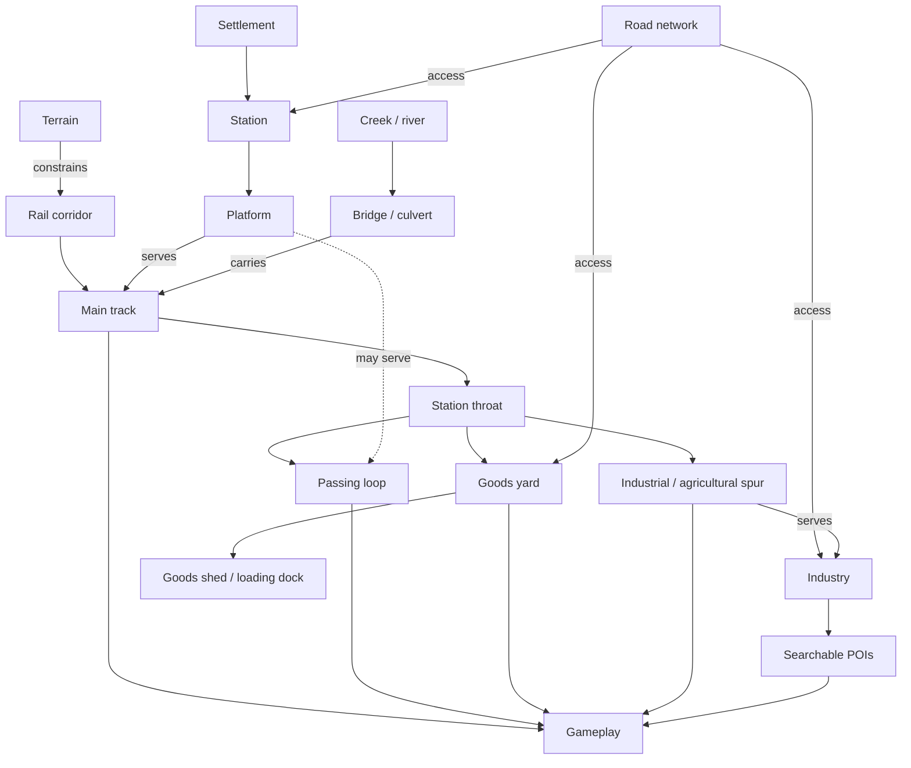
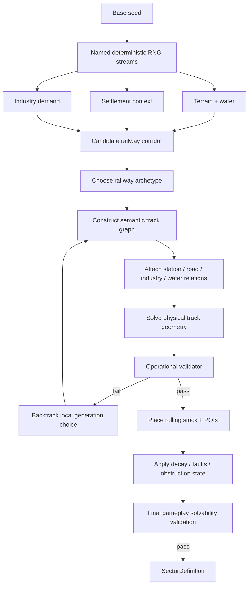

# Central European Railway Grammar for Procedural Railway and World Generation

## Executive summary

The strongest design direction for the next-generation sector generator is to stop thinking of procedural railway generation as **“place some tracks, then decorate the map”** and instead generate a **semantic railway place**:

> **terrain → reason for railway → operating function → track topology → settlement/industry relationships → physical geometry → decay/problem state → gameplay**

That approach is well supported by the research. OpenRailwayMap/OpenStreetMap already distinguishes operationally meaningful track classes such as through/branch tracks, sidings, yards, industrial spurs and crossovers rather than treating every rail segment identically. German railway law likewise distinguishes stations by operational function and separates scheduled/main tracks from other tracks. Infrastructure managers in Austria and Poland treat an industrial siding as a system whose location, connection point, traffic, wagon count, operating method and cargo all matter—not merely as an arbitrary extra line. citeturn16search0turn16search4turn18search0turn19search2turn19search17

For `train_scav`, the practical result should be a **two-layer procedural model**:

```text
SEMANTIC TRACK GRAPH
"What can trains physically do?"

MAIN
PASSING_LOOP
YARD
HEADSHUNT
SPUR
LOADING_TRACK
STORAGE
...

          +

WORLD RELATIONSHIP GRAPH
"Why is it here?"

STATION
TOWN
ROAD
CREEK
BRIDGE
GOODS_SHED
WAREHOUSE
FUEL_DEPOT
GRAIN_SILO
...
```

Only after those graphs pass operational validation should the game produce actual rail curves, terrain, structures, POIs and rolling stock.

The initial Central European grammar should cover six families:

| Archetype | Railway character | Gameplay character |
|---|---|---|
| **Rural through** | Single track, sparse railway estate | Fast travel, light scavenging |
| **Village passing station** | Main + double-ended loop + platform | Simple operational decisions |
| **Small-town goods station** | Loop + compact goods yard/loading | Mixed scavenging and shunting |
| **Agricultural loading point** | Industry/agricultural spur | Food/resource opportunity |
| **River-valley constrained** | Railway squeezed by slope/water/road | Bridges, short leads, difficult manoeuvres |
| **Declining/abandoned branch** | Active route layered with obsolete freight infrastructure | Salvage, failed points, abandoned wagons |

The target “atomic” sector you originally described is effectively a composition of these grammars:

```text
single-track secondary line
        +
passing station
        +
small goods yard
        +
road access / crossing
        +
creek / bridge
        +
industrial or agricultural spur
```

The generator should **not** reproduce real stations literally. Real examples should be analysed into statistics and relationships, then converted into authored rules. This is important both creatively and because OpenStreetMap-derived data is ODbL-licensed; OpenRailwayMap also explicitly prohibits bulk requests against its public API/tiles and advises substantial/commercial users to operate their own infrastructure. citeturn24search0

I have produced the repo-ready package described in this report:

**[Download the complete railway world-generation artifact](sandbox:/mnt/data/rail_worldgen_artifact.zip)**

It contains:

```text
docs/worldgen/
    RAIL_GRAMMAR_CENTRAL_EUROPE.md

data/worldgen/
    rail_graph.schema.json
    rail_archetypes.json
    industries.json
    terrain_rules.json
    sector_fixtures.yaml
    corpus.csv
    sources.json
```

The most important recommendation is to make **semantic topology and solvability permanent architectural boundaries** before substantially increasing visual/procedural variety. That gives later rolling-stock acquisition, infrastructure damage, route choice, factions, scavenging and train growth a world they can reason about rather than a collection of anonymous splines.

## Research scope and evidence corpus

### Research objective

The immediate research target is a **Central European small-town station on a single-track secondary railway**, using Germany, Czechia, Austria and Poland as the first reference region.

The composite target contains:

```text
                  SMALL TOWN
                 ░ ░ ░ ░ ░
                     │
                     │ road
                     │
WEST ========\=======╪====================== EAST
              \   [PLATFORM]
               \==== PASSING LOOP =========/
                \
                 +---- GOODS YARD ----[shed]--|
                  \
                   +---- HEADSHUNT -----------|
                    \
                     \------ INDUSTRIAL SPUR -----[warehouse]

                       ~~~~~ creek ~~~~~
                            [bridge]
```

This is intentionally **not** a claim that a canonical Central European station must contain all of those elements. It is the game's useful composite grammar.

The regional scope should initially encompass topological morphology rather than trying to homogenise national practice. Signalling, exact engineering dimensions, electrification, country-specific operating terminology and architectural style should be separate region/country packs. Germany's EBO, for example, defines a *Bahnhof* operationally as railway infrastructure with at least one switch where trains may begin, end, pass each other or reverse, while a *Haltepunkt* has no switches; it also distinguishes scheduled “main tracks” from other tracks. That is useful conceptual calibration, but it is German regulation rather than a universal Central European definition. citeturn18search0

### Evidence hierarchy

The recommended research hierarchy is:

**Primary infrastructure sources first.** DB InfraGO, ÖBB-Infrastruktur, Správa železnic and PKP PLK provide authoritative contemporary information about their networks. For example, ÖBB says its operating-location descriptions can include track and platform lengths, platform heights and signal locations, although the current detailed documents are restricted to authorised railway undertakings. PKP PLK's public interactive map includes lines, stations, operating points, boundaries and object characteristics, while Správa železnic publishes public network maps covering track counts, traction systems, station elevations and related information. citeturn19search16turn19search0turn23search0

**Historical mapping second.** Modern layouts introduce substantial survivorship bias: goods sheds, loading roads and industrial connections may have disappeared while passenger infrastructure remains. Arcanum's georeferenced Habsburg layers include the Second and Third Military Surveys and cadastral material sourced from institutions including the Austrian State Archives and Austria's federal surveying authority. The Third Military Survey's 1869–1887 timeframe is particularly useful for railway-era settlement relationships in many areas. citeturn20search0turn20search3turn20search12

**OSM/OpenRailwayMap as the semantic and topology layer.** ORM's tagging grammar explicitly distinguishes `service=yard`, `service=siding`, `service=spur` and `service=crossover`; Czech and German ORM documentation uses materially similar distinctions. It is extremely valuable for corpus annotation, but it is crowd-maintained observational data rather than an engineering code. citeturn16search0turn16search4turn16search8

**Photography/aerial imagery as confirmation.** Images should answer questions such as which side of the railway the goods yard occupied, whether freight buildings had road access, whether a spur actually entered an industrial compound, and how settlement/rail/river constraints read visually. They should not substitute for topology evidence where maps or infrastructure documents exist.

### Representative corpus

The downloadable `corpus.csv` contains **30 initial study locations**. They are not all perfect examples of the final archetype; several deliberately serve as contrasts or boundary cases. A rigorous corpus benefits from seeing what distinguishes a halt from a station, a minimal passing point from a goods station and an open rural layout from a valley-constrained one.

For every location, the recommended workflow is:

```text
official/current source
        +
OSM/ORM topology snapshot
        +
current aerial/photo context
        +
historical-map comparison
        ↓
manual annotation
        ↓
confidence score
        ↓
grammar statistics
```

OpenRailwayMap can be inspected at `https://www.openrailwaymap.org/`. Its own documentation states that its underlying railway data comes from OpenStreetMap. citeturn24search0

| Location | Country | Why inspect it | Primary/current source |
|---|---|---|---|
| Bad Kötzting | Germany | Compact small-town station; current two-platform-track reference | [DB InfraGO](https://www.dbinfrago.com/web/bahnhoefe/leistungen/stationsnutzung/stationshalt/stationsausstattung/Bad-Koetzting-12674136) |
| Alsenz | Germany | Three current platform tracks; useful compact station-group comparison | [DB InfraGO](https://www.dbinfrago.com/web/bahnhoefe/leistungen/stationsnutzung/stationshalt/stationsausstattung/Alsenz-12671512) |
| Münchweiler (Alsenz) | Germany | Two-platform-track rural/small-town example | [DB InfraGO](https://www.dbinfrago.com/web/bahnhoefe/leistungen/stationsnutzung/stationshalt/stationsausstattung/Muenchweiler-Alsenz--12676204) |
| Bad Kissingen | Germany | Larger branch/terminus-scale upper-bound comparison | [DB InfraGO](https://www.dbinfrago.com/web/bahnhoefe/leistungen/stationsnutzung/stationshalt/stationsausstattung/Bad-Kissingen-12673952) |
| Bad Köstritz | Germany | Two-track passenger reference; settlement/road relation | [DB InfraGO](https://www.dbinfrago.com/web/bahnhoefe/leistungen/stationsnutzung/stationshalt/stationsausstattung/Bad-Koestritz-12671256) |
| Bad Schussenried | Germany | Three-platform-track upper-bound comparison | [DB InfraGO](https://www.dbinfrago.com/web/bahnhoefe/leistungen/stationsnutzung/stationshalt/stationsausstattung/Bad-Schussenried-12676624) |
| Bad Reichenhall | Germany | Strong town/terrain constraint comparison | [DB InfraGO](https://www.dbinfrago.com/web/bahnhoefe/leistungen/stationsnutzung/stationshalt/stationsausstattung/Bad-Reichenhall-12677858) |
| Bad Kohlgrub Kurhaus | Germany | Single-platform halt baseline: useful negative case | [DB InfraGO](https://www.dbinfrago.com/web/bahnhoefe/leistungen/stationsnutzung/stationshalt/stationsausstattung/Bad-Kohlgrub-Kurhaus-12677002) |
| Bavorov | Czechia | Small regional operating point; current board exposes track IDs | [Správa železnic](https://provoz.spravazeleznic.cz/tabule/Pages/StationTable.aspx?Arr=1&Key=176) |
| Blatná | Czechia | Small-town/regional junction comparison, multiple operating tracks | [Správa železnic](https://provoz.spravazeleznic.cz/tabule/Pages/StationTable.aspx?Key=308) |
| Prachatice | Czechia | Regional small-town station; current track usage | [Správa železnic](https://provoz.spravazeleznic.cz/tabule/Pages/StationTable.aspx?Key=3493) |
| Vodňany | Czechia | Agricultural/small-town context | [Správa železnic](https://provoz.spravazeleznic.cz/tabule/Pages/StationTable.aspx?Key=4855) |
| Strunkovice nad Blanicí | Czechia | Small regional point in agricultural/river landscape | [Správa železnic](https://provoz.spravazeleznic.cz/tabule/Pages/StationTable.aspx?Arr=1&Key=4100) |
| Kájov | Czechia | Regional station in more constrained terrain | [Správa železnic](https://provoz.spravazeleznic.cz/tabule/Pages/StationTable.aspx?Key=1822) |
| Vrábče | Czechia | Rural regional baseline | [Správa železnic](https://provoz.spravazeleznic.cz/tabule/Pages/StationTable.aspx?Arr=1&Key=4874) |
| Stožec | Czechia | Rural/forest branch-line context | [Správa železnic](https://provoz.spravazeleznic.cz/tabule/Pages/StationTable.aspx?Key=4076) |
| Jince | Czechia | Small-town regional station with multiple operating tracks | [Správa železnic](https://provoz.spravazeleznic.cz/tabule/Pages/StationTable.aspx?Arr=1&Key=1785) |
| Hrádek u Sušice | Czechia | Historic regional-station reference | [Správa železnic](https://www.spravazeleznic.cz/) |
| Aspang | Austria | Regional railway morphology and town-edge comparison | [ÖBB Bsb source](https://infrastruktur.oebb.at/en/partners/rail-network/documents-and-data/operating-location-descriptions) |
| Gutenstein | Austria | Compact regional/terminus comparison | [ÖBB Bsb source](https://infrastruktur.oebb.at/en/partners/rail-network/documents-and-data/operating-location-descriptions) |
| Hartberg | Austria | Small-town station/industry-road relationship | [ÖBB Bsb source](https://infrastruktur.oebb.at/en/partners/rail-network/documents-and-data/operating-location-descriptions) |
| Bad Radkersburg | Austria | Historic border/terminal railway morphology | [ÖBB Bsb source](https://infrastruktur.oebb.at/en/partners/rail-network/documents-and-data/operating-location-descriptions) |
| Großraming | Austria | River-valley railway candidate | [ÖBB Bsb source](https://infrastruktur.oebb.at/en/partners/rail-network/documents-and-data/operating-location-descriptions) |
| Grein-Bad Kreuzen | Austria | Danube-valley regional reference | [ÖBB Bsb source](https://infrastruktur.oebb.at/en/partners/rail-network/documents-and-data/operating-location-descriptions) |
| Wierchomla | Poland | Polish ORM example associated with passing/loading function | [Polish ORM tagging](https://wiki.openstreetmap.org/wiki/Pl:OpenRailwayMap/Tagging_in_Poland) |
| Rząsawa | Poland | Passenger/passing/loading functional comparison | [Polish ORM tagging](https://wiki.openstreetmap.org/wiki/Pl:OpenRailwayMap/Tagging_in_Poland) |
| Rypin | Poland | Yard-type operating-point comparison | [Polish ORM tagging](https://wiki.openstreetmap.org/wiki/Pl:OpenRailwayMap/Tagging_in_Poland) |
| Zawidz | Poland | Yard-type operating-point comparison | [Polish ORM tagging](https://wiki.openstreetmap.org/wiki/Pl:OpenRailwayMap/Tagging_in_Poland) |
| Pieniężno | Poland | Industrial/spur-junction comparison | [Polish ORM tagging](https://wiki.openstreetmap.org/wiki/Pl:OpenRailwayMap/Tagging_in_Poland) |
| Bytów | Poland | Declining/reactivated branch context | [PKP PLK maps](https://www.plk-sa.pl/o-spolce/biuro-prasowe/mapy) |

DB's current pages independently confirm the useful range represented by the German sample: Bad Kötzting currently lists two 80 m platform tracks; Münchweiler (Alsenz) two 110 m tracks; Alsenz three 120 m tracks; and Bad Kissingen three platform tracks of differing lengths. These are not proposed game dimensions; they demonstrate that a small/local-station corpus should accommodate meaningful variation in track count and usable platform scale. citeturn17search0turn17search3turn17search9turn17search6

The Czech live operating boards likewise show that candidate regional locations are not uniform: Bavorov exposes distinct track identifiers, Blatná currently uses tracks 2, 3 and 4 in its displayed departures, and Prachatice shows current use of tracks 2 and 3. That makes Czech regional stations particularly useful for learning compact secondary-line operational morphology rather than reducing the grammar to “main + one identical loop”. citeturn22search6turn22search3turn22search16

PKP PLK's corpus utility is especially strong because its public map exposes railway lines, stations, operating points and level crossings, while separate official material covers publicly accessible loading infrastructure. Its industrial-siding connection process explicitly asks applicants to identify the branch point, provide a layout map, forecast train frequency and wagon counts, describe operational methods and identify cargo and rolling-stock restrictions. That is strong primary evidence for modelling industry as an operational relationship rather than merely scenery. citeturn19search0turn19search1turn19search2

### Historical controls

The corpus should also contain **source layers**, not just station names:

| Historical source | Research value |
|---|---|
| [Habsburg Third Military Survey, 1869–1887](https://maps.arcanum.com/en/synchron/thirdsurvey25000/) | Railway-era settlement, road, valley and industrial relationships |
| [Lower/Upper Austria Second Survey](https://maps.arcanum.com/en/map/secondsurvey-austria/) | Pre-/early-rail topographic and settlement structure |
| [Galicia and Bukovina Second Survey](https://maps.arcanum.com/de/map/secondsurvey-galicia/) | Historic Polish/Ukrainian Habsburg regional comparison |
| [Franciscan Cadastre](https://maps.arcanum.com/de/map/cadastral/) | Parcel, settlement and land-use morphology |
| [1866 European railway map, Library of Congress](https://www.loc.gov/item/2011593626/) | Broad historic network context |

Arcanum identifies the Austrian State Archives as a source for the Second Military Survey layers and lists state/cadastral authorities among the sources for its cadastral collection. The correct use is comparative: some cadastral sheets pre-date a railway, so an earlier layer can explain why a later railway followed a valley or bypassed a settlement, while later surveys show the resulting railway morphology. citeturn20search0turn20search2turn20search3turn20search10

## Railway grammar and archetypes

### Formal vocabulary

The distinction between **siding, yard and spur is crucial**.

OpenRailwayMap describes a `siding` as a track generally parallel to through tracks and used for overtaking/holding; `yard` tracks are associated with shunting, assembling/disassembling trains and storage; a `spur` is generally a short connection into an industrial area. A `crossover` connects neighbouring main tracks and is principally relevant to multi-track routes. citeturn16search0turn16search1turn16search2turn16search10

Those semantics should become first-class game data:

| Element | Game definition | Status in target small-town composite | Connectivity | Placement/adjacency |
|---|---|---:|---|---|
| **Main / through track** | Persistent route crossing sector | Required | Entry → exit | Dominant corridor |
| **Passing loop** | Double-ended parallel route allowing a train to clear the through route | Required | Turnout A → loop → turnout B | Parallel to main, preferably station-length |
| **Siding** | Auxiliary parallel railway track for holding/overtaking/storage | Optional | Usually main-adjacent | Close to through route |
| **Goods yard** | Functional group of railway-operated shunting/storage/loading tracks | Required for goods archetype | Station throat → yard group | Flat-ish space + road access |
| **Headshunt** | Dead-end shunting lead used to pull clear and reverse | Conditional | Throat/yard → terminal | Must have useful effective length |
| **Spur** | Connection serving an industrial/agricultural customer | One in target composite | Main/station/yard → industry | Must terminate at meaningful industry |
| **Loading track** | Track positioned for direct transfer of goods | Optional/common | Yard/spur → loading site | Adjacent shed, ramp, silo, warehouse |
| **Platform** | Passenger boarding site linked to passenger-usable track | Required at station archetype | Semantic relationship to track | Pedestrian access toward road/settlement |
| **Station throat** | Game-semantic switch/fan-out area | Required where topology branches | Main ↔ loop/yard/spur | Keep operationally legible |
| **Crossover** | Connector between neighbouring main tracks | Normally absent in single-track baseline | Main A ↔ Main B | Multi-track route only in baseline grammar |
| **Buffer stop** | Explicit end-of-track terminal | Required on active stub ends | Terminal node | Stub/headshunt/yard endpoint |

“Station throat” is deliberately a **game semantic**, not an assertion that this is a distinct OpenStreetMap feature class. Likewise, a headshunt is best treated by the game according to function rather than relying on a single universal OSM label.

A platform should be a semantic site linked to the track that serves it, rather than painted wherever visual space exists. OpenRailwayMap's stop-position guidance similarly associates railway stop positions with relevant station/platform tracks. citeturn16search0

### Core archetypes

#### Rural through

```text
         farm
          |
road -----+------------------------

WEST ============================= EAST
               [halt]
                  \
                   ~ creek ~
```

**Required:** main.

**Optional:** halt/platform, farm access, small spur, field-road crossing, creek/culvert.

**Purpose:** an essential low-complexity baseline. Procedural generation fails if every map tries to be an elaborate puzzle.

**Gameplay:** low shunting complexity, sparse resource opportunities, faster decision to move on.

#### Village passing station

```text
                       village
                          |
road ---------------------X-----------------

WEST ======\======================/======= EAST
            \---- PASS LOOP -----/
                 [platform]
                  [station]
```

**Required:** main, two loop turnouts, passing loop, station/platform.

**Optional:** tiny goods track, crossing, goods shed.

**Gameplay:** first-level railway problem. A wagon occupying the loop can immediately change how the station functions without needing a scripted mission.

#### Small-town goods station

```text
                         town
                  houses / road
                         |
WEST ======\================================ EAST
            \------ PASSING LOOP ----------/
             \
              +---- GOODS TRACK ----[shed]---|
               \
                +---- loading ------[dock]---|
                 \
                  +---- HEADSHUNT -----------|
```

**Required:** main, loop, station, compact goods-yard group.

**Optional:** headshunt, storage track, warehouse spur, goods shed/loading dock.

**Gameplay:** this is likely the **core train_scav sector grammar**. It naturally combines walking, resources, jobs, point operation, shunting and physical rolling-stock acquisition.

#### Agricultural loading point

```text
     fields                silo/co-op
 . . . . .                   [S]
                              |
WEST =========================+========== EAST
                               \
                                \--- loading ---|
                                 \
road ----------------------------X--------------
```

**Required:** main plus a spur/loading function.

**Optional:** loop, silo, co-op, farm fuel store, small storage siding.

**Gameplay:** food-rich location with potential secondary diesel and machinery parts.

The link between a real industrial siding and road/site context is not speculative abstraction: the Polish infrastructure manager's connection process explicitly treats siding location, connection geometry, traffic, wagon numbers, operating method and cargo as a coherent design problem. citeturn19search2

#### River-valley constrained

```text
        hillside
 ///////////////////////

WEST ===\=== station ====[BRIDGE]=========== EAST
         \-- short loop --/     ~~~~~~~~
          \                     ~ river ~
           \--goods--|          ~~~~~~~~

road =========================================
```

**Required:** main and meaningful water/terrain relationship.

**Optional:** compact loop, short goods track, cutting, embankment, parallel road.

**Gameplay:** unusually strong because the terrain itself explains why the railway puzzle is constrained. The generator no longer has to invent artificial short tracks.

Railway-alignment research supports the broader principle that terrain, geological/environmental suitability and major structures must be considered jointly rather than treating an alignment as geometry independent of its environment. Modern optimisation literature explicitly models topographic constraints and automatically considers structures such as bridges and tunnels. citeturn21search1turn21search4turn21search7

#### Declining or abandoned branch

```text
                      abandoned factory
                          [######]
                             |
WEST ======\=================+========== EAST
            \-- old loop ----/
             \
              +-- old goods xxxxx|
               \
                +-- storage -----|

xxxxx = disused / failed railway
```

**Required:** active route or deliberately navigable marginal route.

**Optional:** disused freight yard, abandoned industrial spur, old platforms, old goods shed, failed turnout, derelict wagons.

**Gameplay:** extremely valuable for the game's setting because historical infrastructure becomes present-day opportunity. The player is effectively exploiting railway capacity that modern traffic stopped needing.

### Relationship grammar

The more important generation rules are not object frequencies but **conditional relationships**:



This lets the generator reason:

```text
goods yard exists
    ↓
goods handling needs land
    ↓
goods site needs road access
    ↓
road should actually reach yard
```

instead of:

```text
random warehouse at (x, y)
random road at (x, y)
random siding at (x, y)
```

## Semantic graph and machine-readable model

### Architectural recommendation

The sector should expose **two linked graphs**.

The **track connectivity graph** owns railway topology:

```text
TrackNode
    boundary_entry
    boundary_exit
    turnout
    junction
    buffer_stop
    reference_point

TrackEdge
    main
    passing_loop
    station_track
    yard
    headshunt
    spur
    loading
    storage
    crossover
    engine_siding
    disused_track
```

The **semantic site graph** describes the world:

```text
Site
    station
    platform
    goods_yard
    goods_shed
    loading_dock

    fuel_depot
    warehouse
    workshop
    grain_silo
    agricultural_coop
    sawmill
    quarry

    town
    village
    farm
    road
    level_crossing

    creek
    river
    bridge
    culvert
    embankment
    cutting
    tunnel
```

Relations connect them:

```text
adjacent_to
serves
connected_at
inside
crosses
road_access
platform_serves_track
loading_serves_track
bridge_carries_track
terrain_constrains
walking_access
```

This distinction is important for future game design.

For example:

```text
sector.get_tracks_by_role("spur")
```

answers a railway question.

Whereas:

```text
sector.get_industries()
```

answers a world/economy question.

And:

```text
sector.get_world_relationships("fuel_depot_02")
```

can answer:

```text
fuel_depot_02
  served_by: spur_04
  road_access: road_local_03
  adjacent_to: town_edge_01
```

That becomes useful later for factions, trading, AI expeditions, damage, combat and route evaluation without recoding rail geometry.

### Machine-readable JSON Schema

The downloadable artifact contains the complete `rail_graph.schema.json`. Its core structure is:

```json
{
  "$schema": "https://json-schema.org/draft/2020-12/schema",
  "title": "Semantic Railway Sector Graph",
  "type": "object",
  "required": [
    "schema_version",
    "sector_id",
    "seed",
    "region_pack",
    "archetype_id",
    "terrain",
    "track_nodes",
    "track_edges",
    "sites",
    "relationships"
  ],
  "properties": {
    "schema_version": {
      "type": "string",
      "const": "0.1"
    },
    "sector_id": {
      "type": "string"
    },
    "seed": {
      "type": "integer",
      "minimum": 0
    },
    "region_pack": {
      "type": "string"
    },
    "archetype_id": {
      "type": "string"
    },

    "terrain": {
      "type": "object",
      "required": ["context", "relief", "water"],
      "properties": {
        "context": {
          "enum": [
            "plain",
            "rolling",
            "river_valley",
            "low_hills",
            "upland"
          ]
        },
        "relief": {
          "enum": [
            "flat",
            "gentle",
            "moderate",
            "constrained"
          ]
        },
        "water": {
          "enum": [
            "none",
            "ditch",
            "creek",
            "river"
          ]
        },
        "settlement": {
          "enum": [
            "none",
            "hamlet",
            "village",
            "small_town"
          ]
        }
      }
    },

    "track_nodes": {
      "type": "array",
      "items": {
        "type": "object",
        "required": ["id", "type"],
        "properties": {
          "id": {
            "type": "string"
          },
          "type": {
            "enum": [
              "boundary_entry",
              "boundary_exit",
              "turnout",
              "junction",
              "buffer_stop",
              "reference_point"
            ]
          },
          "state": {
            "enum": [
              "active",
              "failed",
              "locked",
              "disused",
              "abandoned"
            ]
          }
        }
      }
    },

    "track_edges": {
      "type": "array",
      "items": {
        "type": "object",
        "required": [
          "id",
          "from",
          "to",
          "role",
          "status"
        ],
        "properties": {
          "id": {
            "type": "string"
          },
          "from": {
            "type": "string"
          },
          "to": {
            "type": "string"
          },
          "role": {
            "enum": [
              "main",
              "passing_loop",
              "station_track",
              "yard",
              "headshunt",
              "spur",
              "loading",
              "storage",
              "crossover",
              "engine_siding",
              "disused_track"
            ]
          },
          "status": {
            "enum": [
              "active",
              "restricted",
              "failed",
              "disused",
              "abandoned"
            ]
          },
          "usable_length_m": {
            "type": "number",
            "exclusiveMinimum": 0
          },
          "gradient_permille": {
            "type": "number"
          },
          "curve_class": {
            "enum": [
              "straight",
              "gentle",
              "moderate",
              "tight"
            ]
          }
        }
      }
    },

    "sites": {
      "type": "array",
      "items": {
        "type": "object",
        "required": ["id", "type"],
        "properties": {
          "id": {
            "type": "string"
          },
          "type": {
            "enum": [
              "station",
              "platform",
              "goods_yard",
              "goods_shed",
              "loading_dock",
              "fuel_depot",
              "warehouse",
              "workshop",
              "grain_silo",
              "agricultural_coop",
              "sawmill",
              "quarry",
              "town",
              "village",
              "farm",
              "road",
              "level_crossing",
              "creek",
              "river",
              "bridge",
              "culvert",
              "embankment",
              "cutting",
              "tunnel",
              "road_bridge"
            ]
          }
        }
      }
    },

    "relationships": {
      "type": "array",
      "items": {
        "type": "object",
        "required": ["type", "from", "to"],
        "properties": {
          "type": {
            "enum": [
              "adjacent_to",
              "serves",
              "connected_at",
              "inside",
              "crosses",
              "road_access",
              "platform_serves_track",
              "loading_serves_track",
              "bridge_carries_track",
              "terrain_constrains",
              "walking_access"
            ]
          },
          "from": {
            "type": "string"
          },
          "to": {
            "type": "string"
          }
        }
      }
    }
  }
}
```

JSON Schema can prove that data is structurally valid. It **cannot prove that a train can actually perform the required moves**. That must be an explicit semantic validation layer.

### Semantic invariants

An accepted generated sector should satisfy at least:

```text
ACTIVE ENTRY → ACTIVE EXIT
```

for a normal through sector, unless an intentional obstruction exists **and** has a valid repair/resolution path.

A `passing_loop` must be genuinely double-ended:

```text
MAIN ---- turnout A ================= turnout B ---- MAIN
                   \                /
                    === LOOP =======
```

not:

```text
MAIN -------------------------
       \
        ------- LOOP? -------|
```

The latter is a siding/stub, not a passing loop.

An active stub should have explicit terminal semantics:

```text
turnout → spur → buffer_stop
```

A platform must reference an actual usable track:

```text
platform_serves_track(platform_1, loop_1)
```

A bridge must cross an actual world obstacle:

```text
bridge_carries_track(bridge_1, main_04)
crosses(main_04, creek_1)
```

A goods/loading site must physically relate to its railway:

```text
loading_serves_track(grain_silo_1, loading_track_1)
road_access(grain_silo_1, farm_road_2)
```

Most importantly for `train_scav`, **recoverability must be tested**, not assumed:

```text
target wagon exists
      ↓
powered stock can reach target
      ↓
coupler orientation allows connection
      ↓
sufficient lead/headshunt length exists
      ↓
route back to persistent train exists
      ↓
no unavoidable occupation deadlock
```

That is the foundation for procedural shunting that produces **problems rather than broken seeds**.

## Generation and terrain rules

### Generate semantic intent before physical rail

Recommended generation order:



This is similar in spirit to contemporary railway-alignment optimisation research, which does not consider the rail path in isolation but evaluates terrain/geology, environmental suitability and the structural consequences of route choice. Research on automatic railway bypass generation explicitly treats bridges, tunnels, overpasses and underpasses as part of route design rather than decoration after the fact. citeturn21search0turn21search7

### Deterministic random streams

Do **not** have:

```text
RandomNumberGenerator global_rng
```

feeding every generation system in sequence.

Instead derive named sub-seeds:

```text
BASE SEED: 55037

hash(55037, "topology")   → topology RNG
hash(55037, "terrain")    → terrain RNG
hash(55037, "settlement") → settlement RNG
hash(55037, "industry")   → industry RNG
hash(55037, "decay")      → decay RNG
hash(55037, "gameplay")   → gameplay RNG
hash(55037, "cosmetic")   → cosmetic RNG
```

Then adding three bushes does not change:

```text
which side the yard is on
which turnout fails
where the workshop wagon spawned
```

Persistence should identify a generated world as:

```text
generator_version
+
region_pack_version
+
seed
```

rather than `seed` alone.

### Plains

Generation preference:

```text
broad corridor
  ↓
low earthwork
  ↓
larger station footprint possible
  ↓
agricultural loading probability rises
  ↓
roads and rail can cross more freely
```

Good archetypes:

```text
rural_through
village_passing_station
agricultural_loading_point
small_town_goods_station
```

### Rolling terrain

Prefer:

```text
contour-following main
+
local flat/bench for station
+
shallow cut/fill
+
creek culverts
```

Rather than:

```text
straight rail regardless of slope
```

Exact curvature remains unspecified because it depends on the game's physical scale and rail movement model.

### River valley

This should become one of the most important world-generation contexts.

```text
HILLSIDE
////////////////////////////

road ========\
              \
rail =========\========================
               \          [station]
                \========== loop =====
                     |
~~~~~~~~~~~~~~~~~~~~ RIVER ~~~~~~~~~~~~
```

Generation heuristics:

- prefer following the valley corridor;
- minimise repeated major river crossings;
- let road, rail and water form parallel corridors;
- put station expansion on the broadest plausible local bench;
- compress goods/industrial tracks where terrain constrains them;
- create bridges/culverts only when actual crossings occur;
- let terrain naturally constrain headshunt and loop lengths.

The reason this works is stronger than visual realism: it produces **legible operational causality**.

The player sees:

> “The yard is awkward because the railway is trapped between the hillside and river.”

rather than:

> “The proc-gen algorithm happened to make the siding short.”

Alignment research supports treating terrain and major structures as coupled constraints, especially in strongly undulating terrain where bridges/tunnels can dominate route alternatives. citeturn21search2turn21search4turn21search9

### Station gradient

One useful calibration point comes from German EBO §7: for new construction it states that the longitudinal gradient of station tracks—subject to specified exceptions—should generally not exceed **2.5‰**. That is **not** proposed as a universal game hard limit or a Central European rule. It does, however, support a strong generator heuristic: station/yard sites should seek the flattest suitable local ground instead of following the full gradient of a surrounding hill. citeturn17search7

So encode:

```json
{
  "rule": "station_prefers_local_flat",
  "strength": "strong"
}
```

rather than initially encoding:

```json
{
  "max_station_gradient": 2.5
}
```

### Embankments and cuttings

OpenRailwayMap/OSM infrastructure tagging represents railway embankments/cuttings as meaningful mapped infrastructure, while alignment research similarly treats terrain and structural form as coupled variables. citeturn16search0turn21search1

The generator should use them causally:

```text
shallow depression
    +
need to preserve vertical alignment
    ↓
EMBANKMENT
```

```text
low ridge
    +
reasonable route passes through ridge
    ↓
CUTTING
```

Do not scatter:

```text
"random cutting decoration"
```

### Bridge and creek grammar

A bridge should be generated because:

```text
rail corridor
     X
water/road corridor
```

The semantic relationship exists first:

```json
{
  "type": "crosses",
  "from": "main_04",
  "to": "creek_01"
}
```

then:

```json
{
  "type": "bridge_carries_track",
  "from": "bridge_01",
  "to": "main_04"
}
```

That means a future damaged-bridge system can query actual crossings:

```text
sector.get_bridges()
```

and does not need to inspect arbitrary scene geometry.

### Tunnel grammar

Tunnels should be relatively rare in this first small-town grammar.

A tunnel is justified by:

```text
terrain would otherwise require:
extreme detour
OR
unacceptable vertical alignment
OR
major ridge crossing
```

not because a random roll said:

```text
10% tunnel chance
```

This remains particularly important when the future generator reaches alpine environments, where tunnel/bridge structures become a much stronger part of railway morphology. Research on mountain alignment explicitly treats long tunnels and high bridges as major route-forming structures. citeturn21search2turn21search8

### Hard playability validators

Before rendering, reject or repair any generated sector violating these invariants:

| Validator | Required |
|---|---:|
| Active entry → exit route exists | Yes |
| Intentional obstruction has a physically achievable resolution | Yes |
| Required active track belongs to intended network component | Yes |
| Passing loop is double-ended | Yes |
| Active stub terminates explicitly | Yes |
| Platform serves real track | Yes |
| Goods loading site connects to railway and road context | Yes |
| Bridge corresponds to actual obstacle crossing | Yes |
| Expedition POI has walkable access | Yes |
| Player has a legal stopping/working location | Yes |
| Target wagon is physically locomotive-reachable | Yes |
| Target wagon can be extracted | Yes |
| Required reversing move fits effective track length | Yes |
| Initial wagon occupation does not create unsolvable deadlock | Yes |
| Required repair resource is not trapped behind the fault it repairs | Yes |

A particularly useful future subsystem is a **discrete shunting solvability oracle**.

It does not need full physics.

Given:

```text
tracks
turnouts
usable lengths
occupancy
wagon lengths
coupler state
powered units
```

it searches legal state transitions:

```text
route turnout
move consist
couple
uncouple
reverse
clear track
```

and proves:

```text
TARGET_WAGON ∈ PLAYER_TRAIN
```

is reachable.

That lets procedural generation become much more ambitious without relying on human-authored safety.

## Gameplay mapping and authored sector fixtures

### Railway structure should imply gameplay opportunity

The relationship should be:

```text
PLACE FUNCTION
      ↓
POI PROFILE
      ↓
RESOURCE PROFILE
      ↓
ROLLING STOCK PROFILE
      ↓
OPERATIONAL PROBLEM PROFILE
```

not merely:

```text
random loot table
```

For example:

```text
FUEL DEPOT
   ↓
tank/loading infrastructure
   ↓
likely diesel
   ↓
tank wagon candidate
   ↓
spur may need clearing/shunting
```

or:

```text
AGRICULTURAL CO-OP
   ↓
grain/loading shed
   ↓
food
   ↓
covered wagon / hopper
   ↓
trailing-point siding problem
```

The particular resource quantities below are **not historical findings**. Exact game values remain unspecified; they are suggested prototype ranges for balancing.

| Site | Likely game resource | Suggested prototype amount | Rolling-stock affinity | Operational opportunity |
|---|---|---:|---|---|
| Fuel depot | Diesel dominant, some parts | Diesel 6–12; parts 0–3 | Tank wagon | Spur access, failed pump/points |
| Agricultural co-op | Food dominant | Food 6–12 | Covered wagon/hopper | Loading-track service |
| Grain silo | Food dominant | Food 8–14 | Hopper/covered | Dedicated loading siding |
| Warehouse/goods shed | Parts + food | Parts 3–8; food 2–8 | Covered/flat | Yard recovery |
| Railway workshop | Parts dominant | Parts 5–12 | Workshop/maintenance | High-value wagon acquisition |
| Sawmill | Parts + some diesel | Parts 2–6; diesel 0–4 | Flat/stake wagon | Industrial spur |
| Quarry | Parts + machinery fuel | Parts 2–7; diesel 0–4 | Hopper/open wagon | Difficult industrial lead |

### Shunting complexity

Use a 0–5 score as a **summary derived from real operations**, not an authored arbitrary difficulty flag.

Prototype contributing factors:

```text
required reversals
+
required turnout changes
+
couple/uncouple operations
+
need to foul/clear main track
+
constrained usable length
+
infrastructure repair dependency
```

Interpretation:

| Score | Approximate experience |
|---|---|
| 0 | Drive through |
| 1 | One simple turnout/siding action |
| 2 | Basic wagon pickup or run-round |
| 3 | Multiple reversals/turnouts |
| 4 | Constrained yard or fault + shunting |
| 5 | Multi-stage recovery where route planning matters |

### Expedition difficulty

Likewise derive 0–5 from:

```text
walking distance
terrain detour
water/road barriers
number of search targets
haul distance/trips
time pressure
future weather/threat state
```

This lets the generator later balance:

```text
rail challenge high + expedition low
```

against:

```text
rail challenge low + expedition high
```

rather than monotonically making every part of a sector difficult at once.

### Emergent problem grammar

A generated problem should be a **mutation of a valid physical place**.

Start with:

```text
VALID SMALL-TOWN GOODS STATION
```

Then mutate one state:

#### Occupied loop

```text
main ======\================/=====
           \=[W][W][W]=====/
```

Consequence:

```text
passing capacity lost
+
valuable wagons perhaps recoverable
+
yard access potentially obstructed
```

#### Failed points

```text
MAIN =======X==============

             \
              \---- fuel depot
```

The track exists, but `turnout_04.state = failed`.

Crew can repair it through existing job mechanics.

#### Damaged bridge

```text
===== [ DAMAGED BRIDGE ] =====
           ~ river ~
```

The bridge is not a “quest marker”; it is an actual structural relationship attached to the route.

#### Fouled headshunt

```text
YARD ---- turnout ---- HEADSHUNT [W][W]|
```

The player must first clear something before a larger recovery becomes possible.

#### Blocked industrial spur

```text
MAIN ----\
          \--- [derelict wagon] --- fuel tanks
```

Immediate interaction between:

```text
rail operations
+
resource need
```

#### Washed embankment

The semantic terrain structure itself becomes damaged:

```text
embankment.state = failed
```

Future parts/engineering systems can act directly on it.

### Fixture: rural through

**Seed:** `10091`

```text
           FARM
            |
road -------+----------------------

WEST ================================ EAST
                 [halt]
                    \
                     ~ creek ~
                      culvert
```

```yaml
id: rural_through_10091
seed: 10091
archetype: rural_through

terrain:
  context: rolling
  relief: gentle
  water: creek
  settlement: hamlet

tracks:
  - id: main
    role: main
    from: west_entry
    to: east_exit
    status: active

sites:
  - { id: halt, type: platform, state: active }
  - { id: creek_1, type: creek, state: intact }
  - { id: culvert_1, type: culvert, state: intact }
  - { id: farm_1, type: farm, state: intact }

gameplay:
  shunting_complexity: 0
  expedition_difficulty: 1
  resource_bias: [food]
  problem_tags: []
```

**Design purpose:** not every sector should demand railway manipulation. This fixture provides pacing and establishes what “ordinary countryside” looks like.

### Fixture: village passing station

**Seed:** `22017`

```text
                       VILLAGE
                          |
road ---------------------X---------------

WEST =======\====================/======= EAST
             \--- PASS LOOP ----/
                  [platform]
                   [station]
```

```yaml
id: village_passing_22017
seed: 22017
archetype: village_passing_station

terrain:
  context: rolling
  relief: gentle
  water: ditch
  settlement: village

tracks:
  - id: main
    role: main
    from: west_entry
    to: east_exit
    status: active

  - id: loop
    role: passing_loop
    from: turnout_w
    to: turnout_e
    status: active

sites:
  - { id: station, type: station, state: active }
  - { id: platform_main, type: platform, state: active }
  - { id: platform_loop, type: platform, state: active }
  - { id: road_x, type: level_crossing, state: intact }

gameplay:
  shunting_complexity: 1
  expedition_difficulty: 1
  resource_bias: [food, parts]
  problem_tags: [occupied_loop]
```

### Fixture: small-town goods station

**Seed:** `33031`

```text
                           TOWN
                            |
road -----------------------+----------------

WEST =======\============================== EAST
             \----- PASS LOOP ------------/
              \
               +---- GOODS ----[goods shed]---|
                \
                 +---- WAREHOUSE SPUR --------|
                  \
                   +---- HEADSHUNT -----------|

                         ~ creek ~
```

```yaml
id: small_town_goods_33031
seed: 33031
archetype: small_town_goods_station

terrain:
  context: rolling
  relief: gentle
  water: creek
  settlement: small_town

tracks:
  - { id: main, role: main,
      from: west_entry, to: east_exit, status: active }

  - { id: loop, role: passing_loop,
      from: throat_w, to: throat_e, status: active }

  - { id: goods_1, role: yard,
      from: throat_w, to: buffer_goods, status: active }

  - { id: headshunt, role: headshunt,
      from: throat_w, to: buffer_headshunt, status: active }

  - { id: warehouse_spur, role: spur,
      from: goods_turnout, to: buffer_warehouse, status: active }

sites:
  - { id: station, type: station, state: active }
  - { id: goods_yard, type: goods_yard, state: intact }
  - { id: goods_shed, type: goods_shed, state: intact }
  - { id: warehouse, type: warehouse, state: intact }
  - { id: creek_bridge, type: bridge, state: intact }

gameplay:
  shunting_complexity: 3
  expedition_difficulty: 2
  resource_bias: [parts, food]
  problem_tags: [failed_points]
```

This should probably become the **reference fixture used when developing the general generator**.

### Fixture: agricultural loading point

**Seed:** `44021`

```text
FIELDS                    SILO / CO-OP
 . . .                        [S]
                               |
WEST ==========================+========= EAST
                                \
                                 \--- loading ---|
                                  \
road -----------------------------X--------------
```

```yaml
id: agricultural_loading_44021
seed: 44021
archetype: agricultural_loading_point

terrain:
  context: plain
  relief: flat
  water: ditch
  settlement: village

tracks:
  - { id: main, role: main,
      from: west_entry, to: east_exit, status: active }

  - { id: ag_spur, role: spur,
      from: ag_turnout, to: buffer_ag, status: active }

  - { id: loading, role: loading,
      from: load_turnout, to: buffer_load, status: active }

sites:
  - { id: coop, type: agricultural_coop, state: intact }
  - { id: silo, type: grain_silo, state: intact }
  - { id: road_x, type: level_crossing, state: intact }

gameplay:
  shunting_complexity: 2
  expedition_difficulty: 1
  resource_bias: [food, diesel]
  problem_tags: [blocked_spur]
```

### Fixture: river-valley constrained

**Seed:** `55037`

```text
HILLSIDE / CUTTING
/////////////////////////////

WEST ===\=== STATION ====[BRIDGE]=========== EAST
         \-- short loop --/     ~~~~~~~~~
          \                    ~  RIVER  ~
           \-- goods --|        ~~~~~~~~~

road ==========================================
```

```yaml
id: river_valley_55037
seed: 55037
archetype: river_valley_constrained

terrain:
  context: river_valley
  relief: constrained
  water: river
  settlement: small_town

tracks:
  - { id: main_w, role: main,
      from: west_entry, to: bridge_w, status: active }

  - { id: bridge_track, role: main,
      from: bridge_w, to: bridge_e, status: restricted }

  - { id: main_e, role: main,
      from: bridge_e, to: east_exit, status: active }

  - { id: compact_loop, role: passing_loop,
      from: turnout_w, to: turnout_e, status: active }

  - { id: short_goods, role: yard,
      from: turnout_goods, to: buffer_goods, status: active }

sites:
  - { id: river, type: river, state: intact }
  - { id: rail_bridge, type: bridge, state: damaged }
  - { id: station, type: station, state: active }
  - { id: cutting_e, type: cutting, state: intact }
  - { id: road_parallel, type: road, state: intact }

gameplay:
  shunting_complexity: 3
  expedition_difficulty: 3
  resource_bias: [parts, diesel]
  problem_tags: [damaged_bridge]
```

### Fixture: declining or abandoned branch

**Seed:** `66029`

```text
                          ABANDONED FACTORY
                              [####]
                                 |
WEST ========\===================+======= EAST
              \---- old loop ----/
               \
                +--- old goods xxxxx|
                 \
                  +--- storage -----|

xxxxx = disused / failed
```

```yaml
id: declining_branch_66029
seed: 66029
archetype: declining_abandoned_branch

terrain:
  context: low_hills
  relief: moderate
  water: creek
  settlement: small_town

tracks:
  - { id: main, role: main,
      from: west_entry, to: east_exit, status: active }

  - { id: old_loop, role: passing_loop,
      from: turnout_w, to: turnout_e, status: restricted }

  - { id: old_goods, role: disused_track,
      from: old_turnout, to: old_buffer, status: disused }

  - { id: factory_spur, role: spur,
      from: factory_turnout, to: factory_buffer, status: failed }

  - { id: storage, role: storage,
      from: yard_turnout, to: storage_buffer, status: active }

sites:
  - { id: old_station, type: station, state: disused }
  - { id: old_goods_shed, type: goods_shed, state: abandoned }
  - { id: factory, type: warehouse, state: abandoned }
  - { id: creek_bridge, type: bridge, state: intact }

gameplay:
  shunting_complexity: 4
  expedition_difficulty: 3
  resource_bias: [parts, diesel]
  problem_tags:
    - derelict_wagons
    - failed_points
```

The six complete fixtures are provided together in [sector_fixtures.yaml](sandbox:/mnt/data/rail_worldgen_artifact/data/worldgen/sector_fixtures.yaml).

## Implementation package, testing strategy and risks

### Recommended API surface

Codex should eventually expose semantic queries roughly along these lines:

```text
sector.get_tracks_by_role(role)

sector.get_station()

sector.get_loading_tracks()

sector.get_bridges()

sector.get_industries()

sector.get_world_relationships(entity_id)

sector.find_train_path(from, to)

sector.validate_entry_exit()

sector.validate_shunting_recovery(
    target_vehicle_id,
    train_profile
)

sector.get_walkable_pois_from_train()
```

The important architectural rule is:

> **Gameplay systems query semantic world state; they do not reverse-engineer meaning from coordinates.**

A damaged-bridge generator should call:

```text
sector.get_bridges()
```

not:

```text
find every rail spline crossing blue pixels
```

The resource generator should ask:

```text
industry.type == FUEL_DEPOT
```

rather than:

```text
random() < diesel_probability
```

And a future faction/trading system could ask:

```text
sector.get_loading_tracks()
sector.get_industries()
sector.get_station()
```

without knowing how the rail curves were constructed.

### Recommended repository data

The artifact already contains the proposed split:

```text
data/worldgen/
├── rail_graph.schema.json
├── rail_archetypes.json
├── industries.json
├── terrain_rules.json
├── sector_fixtures.yaml
├── corpus.csv
└── sources.json
```

**[rail_graph.schema.json](sandbox:/mnt/data/rail_worldgen_artifact/data/worldgen/rail_graph.schema.json)** defines representation.

**[rail_archetypes.json](sandbox:/mnt/data/rail_worldgen_artifact/data/worldgen/rail_archetypes.json)** defines the six topology families.

**[industries.json](sandbox:/mnt/data/rail_worldgen_artifact/data/worldgen/industries.json)** maps site function to track access, rolling-stock affinity and prototype resource bias.

**[terrain_rules.json](sandbox:/mnt/data/rail_worldgen_artifact/data/worldgen/terrain_rules.json)** separates terrain relationships from track archetypes.

**[corpus.csv](sandbox:/mnt/data/rail_worldgen_artifact/data/worldgen/corpus.csv)** provides the 30-site research starter set.

### World-generation tests

The most useful tests are not “sector contains five curves”.

They are semantic invariants.

#### Data validation

```text
all JSON parses
all YAML parses

all archetype IDs unique
all track-role references valid
all site types valid
all fixtures refer only to known enums
```

#### Topology tests

```text
entry → exit path exists

passing_loop:
    exactly two usable main/station connections

required spur:
    attached to network

active stub:
    explicit terminal/buffer

required track:
    not isolated
```

#### Semantic-world tests

```text
platform → existing track

goods yard → road access

industry → rail access

loading site → loading track

bridge → crossed obstacle

POI → walkable route
```

#### Shunting solvability

For every generated recovery objective:

```text
powered stock can reach target
target can be coupled
target can be removed
required reversal fits
player train can be restored to departure-ready state
```

This should eventually include randomized property testing over many train lengths and orientations.

#### Determinism

Critical tests:

```text
generate(seed=55037)
==
generate(seed=55037)
```

and:

```text
add_new_cosmetic_variant()

generate(seed=55037).track_graph
==
old_generate(seed=55037).track_graph
```

That second test is why named RNG streams matter.

#### Massive seed sweep

Once the semantic generator exists, run perhaps thousands of seeds headlessly:

```text
for each seed:
    generate
    validate schema
    validate connectivity
    validate relationships
    validate shunting objective
```

Every failure should output:

```text
SEED
ARCHETYPE
REGION PACK
GENERATOR VERSION
VALIDATOR FAILURE
```

Then interesting failures become permanent regression fixtures.

This is how the generator can grow in complexity without becoming impossible to debug.

### Research pipeline before Codex implements full proc-gen

The most valuable next artifact is **not more prose**. It is a manually reviewed annotation dataset.

For every one of the 20–30 best corpus locations, produce something like:

```yaml
site_id: cz_bavorov

country: CZ

observation_date: "2026-08-24"

sources:
  official:
    - "Správa železnic ..."
  osm_snapshot:
    - "..."
  historical:
    - "..."

topology:
  through_main_count: null
  passing_loop_count: null
  yard_track_count: null
  industrial_spur_count: null
  active_stub_count: null

station:
  platforms: null
  settlement_side: null
  road_access: null

world:
  water_near_station: null
  railway_water_crossings: null
  road_crossings_near_station: null
  industry_types: []

historical:
  former_goods_yard: null
  former_spurs: null

confidence:
  topology: unreviewed
  terrain: unreviewed
  historical_freight: unreviewed
```

The key rule is:

> **Unknown means `null`; it does not mean “let the LLM make an educated guess”.**

Then use an LLM for:

```text
classification
comparison
hypothesis generation
outlier detection
rule extraction
```

not for fabricating measurements.

### Data acquisition and licensing risk

Do not build a scraper that bulk-downloads OpenRailwayMap tiles. ORM's published terms say bulk requests are forbidden and that commercial/non-public or high-volume uses should host their own service; it also states that the underlying data comes from OSM and is available under ODbL. citeturn24search0

For serious analysis, the cleaner route is:

```text
regional OSM extract
    ↓
local processing
    ↓
freeze research snapshot
    ↓
record attribution/licence metadata
    ↓
derive aggregate grammar
```

There is an additional design/legal benefit to generating **abstract grammar from analysed relationships** rather than copying individual real-world track geometry into the shipped game.

PKP PLK also places explicit conditions on reuse of its published maps, so official sources should be treated as research/verification material according to their respective terms rather than blindly packaged into a commercial game dataset. citeturn19search10

### Principal design risks

**False Central European uniformity.** Germany, Poland, Czechia and Austria share enough railway morphology to support a useful high-level grammar, but detailed signalling, operational terminology, station architecture, railway history and modernisation differ. Keep:

```text
COMMON TOPOLOGY GRAMMAR
```

separate from:

```text
DE_REGION_PACK
CZ_REGION_PACK
AT_REGION_PACK
PL_REGION_PACK
```

**Modern survivorship bias.** A present-day two-track passenger station may once have contained a much richer goods yard. Historical maps therefore need to be sampled alongside current topology. citeturn20search0turn20search12

**Visual realism without operational realism.** This is probably the biggest technical danger. A beautiful siding that cannot actually release the wagon on it is a broken level.

**Overfitting to today's starting train.** Track lengths and shunting validators must use configurable train profiles because later multi-loco operation and longer consists will change what “usable” means.

**Proc-gen sameness.** Moving the same station sideways is not meaningful variation. Variation should exist independently across:

```text
TOPOLOGY
TERRAIN
INDUSTRY
DECAY
ROLLING STOCK
FAULT STATE
RESOURCE PROFILE
```

but conditional relationships should keep those dimensions coherent.

For example:

```text
same small-town goods archetype
+
different terrain
+
different industry
+
different decay
```

can yield:

```text
flat agricultural station
river-constrained workshop town
abandoned timber siding
fuel terminal behind failed points
```

without inventing unrelated map grammars.

### Prioritised development path

The next world-generation sprint should **not** immediately attempt to generate all of Central Europe.

The highest-value progression is:

```text
REAL-WORLD CORPUS
      ↓
ANNOTATED RELATIONSHIPS
      ↓
SEMANTIC GRAPH
      ↓
SIX AUTHORED FIXTURES
      ↓
GRAPH VALIDATOR
      ↓
SHUNTING SOLVABILITY
      ↓
PROCEDURAL TOPOLOGY
      ↓
TERRAIN / GEOMETRY
      ↓
INDUSTRY + POIs
      ↓
DECAY / PROBLEMS
      ↓
PRESENTATION
```

The first coding acceptance should therefore be:

> **All six authored layouts can be represented by the same semantic schema, reconstructed into the game's existing railway system, and pass connectivity/playability validation without archetype-specific railway code.**

Only then move to:

> **Given a seed, generate a novel valid member of one of those archetypes.**

And only after that:

> **Mix archetype, terrain and industry grammars.**

That ordering strongly reduces the risk of building an impressive random-map generator that has no idea whether it has generated a railway puzzle the player can solve.

The deeper strategic payoff is that this architecture serves far more than procedural scenery. Once the game understands:

```text
this is a bridge
this is a goods yard
this track serves a fuel depot
this is the only headshunt
this siding is abandoned
this platform serves this station
this industrial track is reachable from this throat
```

Phase C systems can ask meaningful questions of the same world.

Damaged infrastructure can select actual bridges.

Rolling-stock generation can choose wagons appropriate to an industry.

Recruitment can bias towards settlements/stations.

Trading can reason about industrial sites.

Threats can control chokepoints.

Weather can flood low river crossings.

Route planning can distinguish industrial sectors from agricultural ones.

Survivors can reason about where a repair physically has to occur.

And the railway remains the thing connecting all of them.

That is the real value of the research grammar: **not merely more varied track layouts, but a procedural world whose railway has enough semantic meaning for every future system to interact with it.** citeturn16search0turn18search0turn19search2turn21search1